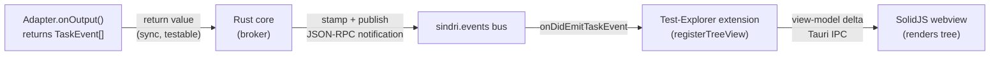

# ADR-0015: JS extension host runtime — QuickJS (Tier 1) + API surface + event bus

- Status: Accepted · **§1–2 superseded by [ADR-0025](0025-js-extension-host-deno-v8.md)** (engine + isolation). §3–6 still in force.
- Date: 2026-06-02
- Closes spike in: [ADR-0006](0006-extension-api-from-day-one.md)
- Extends: [ADR-0009](0009-remote-execution-environments.md), [ADR-0014](0014-sindri-adapter-protocol.md)
- Extended by: [ADR-0019](0019-theme-and-icon-system.md) — adds `sindri.themes` + `sindri.iconThemes` to the §4 API surface

> **⚠️ Addendum (2026-06-09) — engine & isolation superseded by [ADR-0025](0025-js-extension-host-deno-v8.md).**
> After implementing M0–M2, the **§1 QuickJS engine** and **§2 one-Runtime-per-extension + future-bridged async** decisions are replaced by **Deno/V8 (`deno_core`) with a uniform, lean-configured per-isolate model**. The drivers: the `rquickjs` async bridge is a compounding per-milestone tax; QuickJS has no V8 Inspector (a hard DevTools wall); and the per-instance memory argument below — the *only* counterweight — collapses once isolates are lean-configured (snapshot + small heap limits ≈ ~2–3 MB resident). The "Tier 2 reserved host" framing (§Consequences) is dissolved: V8 is now Tier 1, so the WASM/compute/DevTools ceilings are resolved at Tier 1. The single reserved tier is now the **separate-process boundary for untrusted extensions** (trust/placement, not engine).
> **Still in force from this ADR:** §3 ESM build model, §4 `sindri.*` API surface, §5 event bus, §6 permissions/security boundary. The engine swap does not change the extension authoring model. See ADR-0025 for the full rationale and the failure-mode/security analysis behind per-isolate.

## Context

ADR-0006 decided the extension host model (separate process, JS-over-JSON-RPC) and locked "JS-first" but deferred two questions to a spike:

1. **Which JS engine to embed** — QuickJS (via `rquickjs`/quickjs-ng) or Deno core (V8)?
2. **Extension API surface + event bus shape** — what does `sindri.*` look like, and how do `TaskEvent`s flow?

ADR-0014 (SAP) now defines the first real consumer of that API: adapters export `discover`, `plan`, `onOutput`, `onExit`, and optionally `debugConfig`. ADR-0013 adds run/test panels and language packs as additional consumers under the dogfood rule — "everything is an extension." These two ADRs are the forcing function: the API must be expressive enough to implement them all.

### The workload

The extension host is an **orchestration + light-parse** layer. What extensions actually do:

- SAP adapters: receive already-extracted byte records from the Rust core, parse them into `TaskEvent[]` (JSON.parse, regex, small per-task state machines). The heavy byte-shoveling happens in Rust, not JS.
- Language packs: describe how to launch LSP/DAP servers (`ProcessSpec` + capability map). The core owns protocol routing.
- UI extensions (panels, trees, status bar): build view-model deltas from events. SolidJS in the webview owns rendering.

No genuine compute-bound hot path runs in JS. The JS engine is invoked for orchestration, short parses, and view-model assembly.

---

## Decision

### 1. Runtime: QuickJS via `rquickjs` (quickjs-ng fork)

**QuickJS is the Tier 1 runtime.** A Tier 2 host (V8 or WASM) is explicitly reserved for future compute-heavy or WASM-module extensions (see Consequences).

| Dimension | QuickJS (`rquickjs`/quickjs-ng) | Deno core (V8) | Why it matters here |
|---|---|---|---|
| Binary size | **~1–2 MB** | ~20–40 MB | Installer + startup |
| Memory per engine instance | **~hundreds of KB** | ~5–10 MB+ | Multiplied by every active extension |
| JIT speed | No (interpreter) | Yes | Irrelevant — workload is I/O + short parse |
| Default global surface | **Empty** | Bare but composable | Determines security posture |
| Per-extension isolation | **Cheap — one Runtime each** | Heavy — V8 isolates not affordable per-ext | The isolation model |
| npm/Node compat | Bundle-at-build (esbuild) | Possible via deno crates | Well-trodden path (VSCode model) |
| WASM module support | ✗ | ✅ | Real ceiling — see Consequences |
| DevTools debugging | ✗ | ✅ (V8 inspector) | DX cost — see Consequences |

**The per-instance memory figure is decisive.** A real polyglot Sindri project (Rust + Web + Python) activates 10–15 extensions concurrently. At V8's per-instance cost, true per-extension isolation (~5–10 MB × 15 ≈ 75–150 MB overhead) is unaffordable. Sharing a V8 context to save memory surrenders the isolation goal. QuickJS makes per-extension isolation cheap enough to be the default (15 × ~0.3 MB ≈ 4–5 MB total).

**The deny-by-default surface is a security gift.** A fresh QuickJS runtime has no `fs`, `net`, `child_process`, or any ambient capability — they don't exist until the core injects them. V8-based environments start with more surface and require active removal. Since SAP mandates that all filesystem and process access is funneled through `sindri.env` (enforcing ADR-0009 environment scoping), QuickJS's emptiness is the natural starting state.

---

### 2. One Runtime per extension, Rust-future-backed async

Each activated extension runs in its own `rquickjs::Runtime` on its own thread. Consequences:

- A throw, leak, or infinite loop in one extension cannot corrupt a sibling.
- A CPU-watchdog interrupt handler kills runaway extensions without crashing the host process.
- The GC of each runtime is independent — no cross-extension GC pauses.

Async calls into the Rust core (all `sindri.env.*` operations) are backed by Rust futures bridged into QuickJS's event loop. Extensions write `await sindri.env.fs.read(path)` and it just works; the JS never busy-waits.

---

### 3. Extension build model: single ESM bundle via esbuild

Extensions are **bundled to a single ESM file at build time**. This is the VSCode model, and it sidesteps the npm-compat question: pure-JS dependencies are folded into the bundle by esbuild; native Node addons (undesirable in a sandbox anyway) are not supported. Authors write TypeScript against the `@sindri/api` type definitions; the build toolchain (part of the extension SDK) produces the bundle.

---

### 4. API surface: layered `sindri.*` globals, injected per-manifest

The host injects only the namespaces an extension's manifest declares. Nothing else exists in scope.

```
sindri.commands     register(id, fn) · execute(id, …)
sindri.window       registerTreeView · registerPanel · createStatusBarItem
                    (view-model contributions only — no DOM access)
sindri.workspace    roots · sindri.toml · configuration · onDidChangeConfiguration
sindri.editor       document model proxy · selections · decorations · onDidApplyEdit
sindri.languages    registerCompletionProvider · registerHoverProvider ·
                    registerDiagnosticProvider  (raw provider API, not LSP)
sindri.lsp          registerServer(id, {launch: ProcessSpec, capabilities})
sindri.dap          registerAdapter(id, {launch: ProcessSpec})
sindri.tasks        registerAdapter(id, SapAdapter)  ← SAP contract (ADR-0014)
sindri.env          fs.read · fs.glob · fs.exists · exec(ProcessSpec)
                    ← THE single funnel; all calls are env-scoped + path-translated
sindri.events       on(eventId, handler) · emit(eventId, payload)
```

`sindri.env` is the **only** route to filesystem and process access. The core enforces ADR-0009: every `fs.*` path is target-space (translated by the core if the project runs in a container/WSL/SSH environment), and `exec` calls are subject to the same environment scoping as SAP's `host.exec`.

`sindri.lsp` and `sindri.dap` let language packs hand the core a `ProcessSpec` — the core owns the hot-path JSON-RPC routing. The raw `sindri.languages` provider API still exists for non-LSP sources (keeping the dogfood rule honest: a non-LSP extension can contribute completions first-class).

Extensions export a single `activate(context: ExtensionContext)` function. Deactivation is via `context.subscriptions`.

---

### 5. Event bus: return → broker → subscribe



- **Commands** = directed request/response. **Events** = broadcast, typed, fire-and-forget.
- **Adapters never touch the bus.** They *return* `TaskEvent[]` synchronously from `onOutput`/`onExit`. This keeps them pure, unit-testable, and free of bus-wiring concerns (per SAP, ADR-0014).
- **The core is the broker.** It receives returned events, stamps them (taskId, timestamp, generation for watch-mode), and publishes on `sindri.tasks.onDidEmitTaskEvent`.
- **UI extensions are subscribers.** The test-explorer extension subscribes to `onDidEmitTaskEvent`, builds a tree view-model, and registers it via `sindri.window.registerTreeView`. The test panel is an ordinary extension on the public API — this is the dogfood proof.

Bus events available to all extensions (selection, not exhaustive):

```ts
sindri.tasks.onDidEmitTaskEvent      // TaskEvent (SAP union)
sindri.tasks.onDidChangeTaskState    // task started / cancelled / finished
sindri.workspace.onDidChangeRoots
sindri.workspace.onDidSaveDocument
sindri.editor.onDidChangeSelection
sindri.editor.onDidOpenDocument
```

---

### 6. Permissions + security boundary

Manifest-declared permissions gate what namespaces the core injects:

| Permission | Grants |
|---|---|
| `env.fs` | `sindri.env.fs.*` scoped to project root(s) |
| `env.exec` | `sindri.env.exec` — required for SAP adapters |
| `workspace.write` | `sindri.workspace` write methods |
| `editor.mutate` | `sindri.editor` edit/decoration writes |

`net` is **off** by default; no extension can open a socket without a future `net` permission (not yet scoped — deferred). Adapters and UI-contributing extensions share the same sandbox model; they differ only in which permissions they declare.

---

## Consequences

### What we gain

- **Editor-weight runtime.** QuickJS + one Runtime per extension adds ~4–5 MB for a fully-loaded polyglot project. Consistent with the ADR-0001/ADR-0005 mandate of "language-agnosticism at editor weight."
- **Deny-by-default security.** The extension can do nothing except what the core explicitly hands it. No ambient surface to harden after the fact.
- **True crash isolation per extension.** A misbehaving SAP adapter cannot corrupt the test-explorer extension or the core.
- **SAP is unit-testable.** Adapters return `TaskEvent[]` synchronously; tests feed mock bytes in, assert events out, never need a live host.
- **Test-explorer-as-extension proves the dogfood rule.** When the day-one test panel is implemented as a subscriber to `sindri.tasks.onDidEmitTaskEvent` + a `sindri.window.registerTreeView` contributor, the API is real (ADR-0013 / ADR-0006 satisfied).

### Ceilings and how we handle them

**No WASM module support in Tier 1.** An extension cannot `new WebAssembly.Instance(buffer)`. This is the sharpest real ceiling. Sindri's own day-one packs are not affected (Tree-sitter runs as native Rust in the core per ADR-0003/0005; adapters parse JSON/text), but a community extension wanting to embed a WASM-compiled tool cannot. **Mitigation**: such extensions should spawn the native binary via `sindri.env.exec` instead; the design already encourages this. If demand for in-process WASM grows, Tier 2 addresses it.

**Modest compute speed.** QuickJS is an interpreter; V8 is 2–10× faster on compute-bound JS. For orchestration + parse workloads this is invisible. For a hypothetical extension doing heavy in-JS data processing, it matters. **Mitigation**: same as WASM — spawn a native process. If that becomes a common blocker, Tier 2.

**No DevTools-attach debugging.** Extension authors cannot attach Chrome DevTools. **Mitigation**: source-mapped stack traces in the extension host log, structured error reporting, fast reload on file change, and a `sindri.dev` mode that logs all `sindri.*` calls and return values. Acceptable for the majority; the Tier 2 path restores this for authors who need it.

### Tier 2 host (reserved, not designed)

A second host tier is **explicitly reserved** for extensions that genuinely need WASM, heavy compute, or DevTools-level debugging. Likely shape: a separate optional host process embedding `deno_core`, loadable on demand, implementing the same JSON-RPC contract as the QuickJS host so the rest of the system is unchanged. The seam is preserved; the design decision is deferred until a real use case drives it. WASM/WASI (the Zed model) is also still on the table as a third host for sandboxed polyglot plugins (per ADR-0006).

### Deferred from this ADR

- Manifest permission schema (fine-grained `env.fs` path scoping; `net` permission fields)
- DevTools-gap debugging tooling (source maps, `sindri.dev` mode specifics)
- `sindri.window` custom panel / iframe escape hatch for richer UIs
- Extension SDK scaffolding + `@sindri/api` type package
- Formal Tier 2 host design

## See also

- [ADR-0006](0006-extension-api-from-day-one.md) — JS host model; dogfood rule; QuickJS/Deno deferred
- [ADR-0009](0009-remote-execution-environments.md) — `Environment` trait; why `sindri.env` must funnel all exec/fs
- [ADR-0013](0013-product-identity-and-polyglot-thesis.md) — everything is an extension; day-one bundled extension set
- [ADR-0014](0014-sindri-adapter-protocol.md) — SAP; the adapter API surface this host must express
