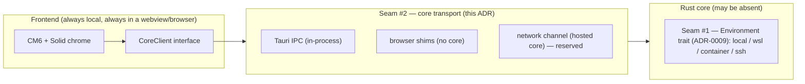

# ADR-0017: Browser / PWA target — distribution scope & the core-transport seam

- Status: Accepted
- Date: 2026-06-02
- Extends: [ADR-0001](0001-shell-tauri.md), [ADR-0003](0003-editor-surface-cm6-plus-webgl2.md), [ADR-0009](0009-remote-execution-environments.md)
- Relates: [ADR-0012](0012-project-file-format.md), [ADR-0015](0015-js-extension-host-runtime.md), [ADR-0016](0016-editor-buffer-and-tab-model.md)

## Context

Building the workspace filesystem against an abstraction produced a three-tier FS
([`src/lib/tauri.ts`](../../src/lib/tauri.ts)) that already runs the editor outside
Tauri:

| Tier | Runtime | FS reality |
| --- | --- | --- |
| 1 | Tauri desktop | real disk via Rust `read_file`/`write_file`/… commands |
| 2 | Chromium/Edge browser | **real disk** via the File System Access API (`showDirectoryPicker`, `createWritable`) |
| 3 | Firefox / Safari / older | in-memory tree from `webkitdirectory`; saves download as files |

So today, with no server at all, a browser can open a folder, edit, save to disk
(tier 2), switch tabs, persist layout, and create/rename/delete files. That capability
fell *out of* the FS abstraction; it was never a deliberate product decision. This ADR
makes the decision, because "the editor runs in a browser" is quietly being mistaken for
"Sindri is a web IDE," and those are very different commitments.

**The load-bearing architectural fact:** CodeMirror 6 owns the canonical live document
client-side (vision §4, [ADR-0003](0003-editor-surface-cm6-plus-webgl2.md),
[ADR-0016](0016-editor-buffer-and-tab-model.md)) — we deliberately do *not* mirror a rope
in Rust. Therefore the **editor surface needs no backend to function.** Everything that
makes Sindri *an IDE rather than an editor*, by contrast, lives in the Rust core: LSP,
DAP, the SAP run/test adapters ([ADR-0014](0014-sindri-adapter-protocol.md)), ripgrep
search, git, file watching, and the QuickJS extension host
([ADR-0015](0015-js-extension-host-runtime.md)). The wedge (vision §3 — performance **+**
built-in run/test/debug for every language) is **entirely core-resident.**

> ⚠️ **The trap this ADR exists to close:** a browser with no core is a competent text
> editor. It is *not* Sindri — it has none of the wedge. Portability of the editor must
> not be confused with portability of the product.

## Decision

### 1. Product scope: **desktop-first, browser-capable** — three capability tiers, not three co-equal products

Sindri is a **desktop IDE** (Tauri, [ADR-0001](0001-shell-tauri.md)). That is *the*
product and the only target we commit to shipping the full wedge on. The browser is a
**capability gradient**, not a second product we promise feature-parity for:

| Tier | Name | Core present? | What it is |
| --- | --- | --- | --- |
| **A** | **Desktop** (Tauri) | yes, in-process | The product. Full wedge. |
| **B** | **Browser editor-only** | **no core** | A real, working **editor / playground / quick-edit** surface. No wedge. |
| **C** | **Web-IDE** (hosted core) | yes, over network | The full IDE in a browser tab, core running server-side. **Future, reserved.** |

- **Tier A** is where every feature is built and verified first.
- **Tier B** ships as a **byproduct we keep alive**, not a roadmap commitment. It is the
  honest browser story for the foreseeable future: edit local files (real disk on
  Chromium via FSA), highlighting, multi-tab, layout, search-in-open-buffers. Useful as a
  demo, a "open this repo and read/tweak a file" surface, and a PWA (§5). It is explicitly
  **not marketed as an IDE** because it structurally cannot run the wedge.
- **Tier C** — a browser tab driving a *remote* Rust core — is the only configuration in
  which a browser is a full Sindri IDE (this is the vscode.dev → Codespaces distinction:
  the editor is portable, the IDE requires a backend). We **reserve the seam** for it
  (§2) and **do not build it** in the current horizon.

### 2. The core-transport seam (the second abstraction, parallel to the `Environment` trait)

There are **two independent seams**, on opposite sides of the IPC boundary, and they must
not be conflated:

- **Seam #1 — `Environment` trait** ([ADR-0009](0009-remote-execution-environments.md)):
  *core-internal.* Where files/processes live **relative to the core** (local, WSL,
  container, SSH). Browser mode does **not** add an `Environment` — in Tier B there is no
  core, so there is nothing for an `Environment` to be.
- **Seam #2 — core transport (the `CoreClient`):** *frontend-side.* **How, or whether,
  the webview reaches a core at all.** Three implementations:
  1. **Tauri IPC** — in-process core (Tier A). Exists.
  2. **Browser shims** — *no core*; FS is served by the three-tier in-page implementation,
     and core-only capabilities are absent/stubbed (Tier B). Exists, informally.
  3. **Network channel** — JSON-RPC over WebSocket/HTTP to a hosted core (Tier C).
     **Reserved, unbuilt.**

**Decision:** formalize seam #2 as a single `CoreClient` interface and route capability
access through it, *replacing the scattered `isTauri()` branches* in
[`src/lib/tauri.ts`](../../src/lib/tauri.ts) with one explicit transport boundary. Today
those branches already are this seam in disguise; naming it now keeps Tier C additive
(a third `CoreClient` impl) rather than a frontend rewrite — the same discipline ADR-0009
applied to the Rust side.

> The clean symmetry: **ADR-0009 makes the core's notion of "where things run" pluggable;
> this ADR makes the frontend's notion of "what core, if any, I'm talking to" pluggable.**
> Tier C is literally the composition of both — a network `CoreClient` reaching a core
> whose active `Environment` happens to be the server's `local`.

### 3. Browser mode boundaries (Tier B)

What the browser sandbox **forbids**, and how we degrade rather than pretend:

| Concern | Desktop (A) | Browser (B) | Resolution |
| --- | --- | --- | --- |
| Process spawn / shell exec | yes (Rust) | **never** (sandbox) | Run/test/debug/LSP/DAP simply absent in B; UI affordances disabled, not faked. |
| Native dialogs | Tauri plugin-dialog | **none** | FSA `showDirectoryPicker` / `<input type=file>` (already implemented). |
| Filesystem | Rust commands | three-tier shim | FSA (real disk, Chromium) → `webkitdirectory` in-memory (fallback). Done. |
| Content search | ripgrep (Rust) | **client-side only** | Search restricted to open buffers / the in-memory tree; no ripgrep. |
| git | Rust | **none** in B | Deferred; a future client-side or hosted-core path, not now. |
| File watching | Rust notify | **none** in B | No external-change events; FSA has no watch. Accept stale-on-disk. |

Rule: **a capability the active `CoreClient` cannot provide is reported as unavailable**
(disabled command, empty provider) — never stubbed to look like it works. This is the same
deny-by-default honesty as ADR-0015's empty-globals posture, applied to distributions.

### 4. Engines: what runs where

| Engine | A (desktop) | B (editor-only browser) | C (hosted web-IDE) |
| --- | --- | --- | --- |
| **CM6 editing / undo / multi-cursor** | ✅ local | ✅ local | ✅ local |
| **WebGL2 tiered renderer** (ADR-0003/0007) | ✅ | ✅ (pure client GPU) | ✅ |
| **Tree-sitter highlighting** | ✅ native, in Rust core (structural source of truth) | ⚠️ degraded — **`web-tree-sitter` (WASM)** or CM6's Lezer, client-side | ✅ native, server-side |
| **LSP / DAP** | ✅ | ❌ (no process host) | ✅ servers run server-side |
| **SAP run/test** (ADR-0014) | ✅ | ❌ | ✅ |
| **Extension host** (ADR-0015) | ✅ QuickJS in core | ❌ none (see §6) | ✅ QuickJS in hosted core |

The single nuance: **Tree-sitter is the one engine that is genuinely portable to a
core-less browser**, because grammars compile to WASM (`web-tree-sitter`). ADR-0003 keeps
the Rust Tree-sitter layer as the structural source of truth; Tier B is the exception that
falls back to WASM/Lezer client-side. This is a *reserved* path, not a v0 commitment —
Tier B can ship with plain-text or Lezer highlighting first.

### 5. Distribution strategy

- **Desktop (A):** Tauri 2 bundles per OS (the existing build). Primary artifact.
- **Browser editor-only (B):** the frontend is already a Vite-built static web app
  (`isTauri()` false → browser path). Served as static assets from any host/CDN. No
  server logic. This is also the substrate for the PWA.
- **PWA:** add a web app manifest + service worker on top of Tier B → an **installable,
  offline-capable local-files editor** (FSA persists across sessions, see §6). Low cost,
  reasonable to offer once Tier B is solid; it inherits **every** Tier-B limitation (no
  wedge). The PWA is "Sindri the editor, installable," **not** "Sindri the IDE, offline."
- **Web-IDE (C):** a served frontend + a hosted Rust core reachable via the network
  `CoreClient`. Real product surface, **future**; the seam (§2) is the only thing we
  build toward now.

### 6. Resolved open questions

- **Workspace / layout persistence** → deferred to settings + project files
  (`sindri.toml`, [ADR-0012](0012-project-file-format.md)). Layout already persists locally.
  In the browser, FSA directory handles can be stored in **IndexedDB** to re-grant folder
  access across reloads without re-picking — that is the browser persistence path, and it
  is **deferred**, not designed here.
- **Extension host in the browser** → QuickJS ([ADR-0015](0015-js-extension-host-runtime.md))
  is a *core-process* runtime; embedding it in a browser (which already has a JS engine) is
  pointless. The correct browser host, *if ever needed*, is a **Web Worker implementing the
  same JSON-RPC contract** — a sibling of ADR-0015's reserved Tier-2 host, selected by the
  platform. But it is largely moot: most extensions are core-dependent (their
  `sindri.env.*` calls have no exec/fs target without a core), so **Tier B runs no
  extensions**, and Tier C reuses the desktop QuickJS host server-side. Reserved, unbuilt.

## Consequences

**We gain**
- A decided, honest scope: desktop is the product; the browser editor is a kept-alive
  byproduct; the web-IDE is a reserved future — no accidental scope creep into a half-IDE.
- A named frontend seam (`CoreClient`) that makes the hosted web-IDE additive, mirroring
  what ADR-0009 did for the core. The two seams compose cleanly into Tier C.
- A free PWA story sitting on top of Tier B at low marginal cost.

**We accept**
- A **refactor obligation:** the `isTauri()` branching in `src/lib/tauri.ts` should
  converge on the `CoreClient` interface so capabilities (not just FS) route through one
  boundary. Cheap now, increasingly expensive as more core-touching features land.
- **Capability-gating UI work:** commands/panels must render an "unavailable here" state
  driven by the active `CoreClient`'s declared capabilities — real UI, built once.
- **Tier B has no wedge, permanently,** absent a core. We message it as an editor, never
  an IDE, to protect the product's positioning (vision §3).
- A second, lower-fidelity **highlighting path** (WASM/Lezer) exists only for Tier B,
  diverging from ADR-0003's Rust-Tree-sitter source of truth in that mode alone.

**We explicitly do not do now**
- Build the network `CoreClient`, the hosted-core deployment, server-side language-server
  multiplexing, git-in-browser, or the Web Worker extension host. All reserved behind the
  seam.

## Alternatives considered

| Option | Verdict | Why |
| --- | --- | --- |
| **Desktop-only; drop browser entirely** | ✗ | Throws away a working, free capability and the cheap PWA + future web-IDE optionality; the seam costs little to keep. |
| **Browser as a co-equal first-class IDE now** | ✗ | The wedge is core-resident; a browser without a core cannot run it. Committing to parity means building/operating a hosted core *now* — a different, larger product. |
| **Mirror the doc/engines into the browser (client-side LSP/DAP via WASM)** | ✗ | WASM language servers/debuggers are immature and per-language; re-earns the core in JS, contradicting ADR-0003's "no second rope" and ADR-0001's lean thesis. `web-tree-sitter` for *highlighting only* is the one tractable exception. |
| **Scatter `isTauri()` checks indefinitely** | ✗ | Works for FS today but makes Tier C a frontend rewrite; the `CoreClient` seam is the same insurance ADR-0009 bought on the Rust side. |

## See also

- [ADR-0001](0001-shell-tauri.md) — Tauri shell; the desktop product
- [ADR-0003](0003-editor-surface-cm6-plus-webgl2.md) — CM6 owns the client-side doc (why the editor is core-independent)
- [ADR-0009](0009-remote-execution-environments.md) — the *other* seam; Tier C composes with it
- [ADR-0015](0015-js-extension-host-runtime.md) — QuickJS host; why the browser host is a reserved sibling
- [ADR-0016](0016-editor-buffer-and-tab-model.md) — reactive-metadata / imperative-engine split that keeps the frontend portable
