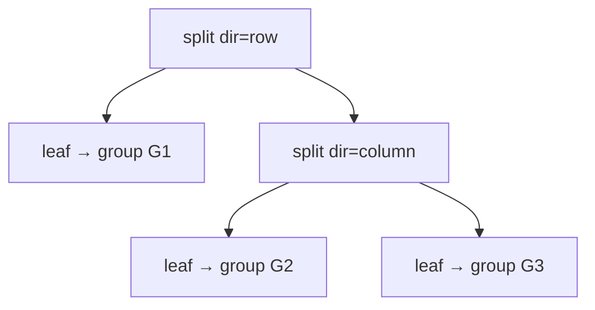
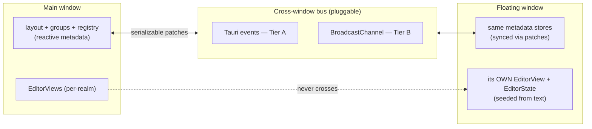

# ADR-0018: Editor split panes, advanced sidebar docking, and floating windows

- Status: Accepted
- Date: 2026-06-02
- Extends: [ADR-0016](0016-editor-buffer-and-tab-model.md), [ADR-0010](0010-dockable-panel-layout.md)
- Relates: [ADR-0001](0001-shell-tauri.md), [ADR-0007](0007-webgl2-not-webgpu.md), [ADR-0017](0017-browser-pwa-target.md)

## Context

Three layout capabilities separate a "tabbed editor" from a "JetBrains-grade workspace,"
and all three were promised but deferred: **editor split panes** (VSCode-style), **sidebar
sub-zones** (primary/secondary per rail, ADR-0010), and **floating windows** (tear a pane
or tool window into its own OS window, ADR-0010 §floating).

What exists today constrains the design:

- **[ADR-0016](0016-editor-buffer-and-tab-model.md):** *one* CM6 `EditorView` mounted for
  the app's life; tabs swap `EditorState` via `view.setState()`. `EditorState` lives in a
  plain `Map` keyed by `bufferId`; reactive tab metadata (`tabs[]`, `activeId`) lives in a
  Solid store ([`src/editor/buffers.ts`](../../src/editor/buffers.ts)). One view, one
  `activeId`, globally.
- **[`src/workbench/layout.ts`](../../src/workbench/layout.ts):** `DockId = "left" |
  "right" | "top" | "bottom"` — **one slot per rail.** `WindowState` already carries a
  `floating: boolean` that nothing yet honours.
- **[ADR-0007](0007-webgl2-not-webgpu.md):** browsers cap WebGL2 contexts (~16). A
  view-per-*tab* model was rejected for this reason; the cap now governs how many *panes*
  we may mount.
- **[ADR-0017](0017-browser-pwa-target.md):** the frontend runs in Tauri (Tier A) **and**
  a bare browser (Tier B). Anything cross-window must work over a Tauri transport *and* a
  browser transport, or be honestly tiered.

> ⚠️ **The one fact that drives everything below:** a CM6 `EditorState` is **neither
> shareable between two live views nor serializable across an OS-window boundary.** It
> fuses the document, history, selection, and a graph of extension closures into one
> per-realm object. Splits and floats both ask "show this buffer in a second place" — and
> the second place can have neither the same `EditorState` object nor a copy of it. This is
> not an implementation detail; it is the shape of the problem.

## Decision

### 1. Editor area becomes a recursive split tree; a new `groups` store owns it

The editor area is no longer "one tab strip + one view." It is a **recursive tree of split
nodes whose leaves are editor groups**, each group being its own tab strip with its own
active buffer and its own view.

This is **editor-area** structure, distinct from the **tool-window dock** structure in
`layout.ts`. Mixing them would bloat one store with two unrelated concerns. We add a new
reactive store, [`src/editor/groups.ts`](../../src/editor/groups.ts) — pure serializable
metadata, exactly the kind ADR-0016 says belongs in a Solid store:

```ts
type GroupId = string;

interface EditorGroup {
  id: GroupId;
  bufferIds: string[];     // tab order within this group
  activeBufferId: string;  // active tab in this group
}

type SplitNode =
  | { kind: "leaf"; group: GroupId }
  | { kind: "split"; dir: "row" | "column"; children: SplitNode[]; sizes: number[] };

interface GroupStore {
  root: SplitNode;
  groups: Record<GroupId, EditorGroup>;
  activeGroup: GroupId;   // focused pane: where new opens land, where Save reads
}
```



- **Direction convention** (stated once to kill the row/col ambiguity that already bites
  `Splitter`): `dir: "row"` = children side-by-side with a **vertical** divider = **Split
  Right**; `dir: "column"` = children stacked with a **horizontal** divider = **Split
  Down**. The group splitter reuses `Splitter` aligned to this convention.
- **Recursive:** splitting a leaf replaces it with a `split` node holding the old leaf plus
  a new sibling leaf. Closing the last tab in a group removes its leaf and collapses the
  parent split (a split with one remaining child becomes that child).
- **`buffers.ts` narrows to a buffer *registry*.** `tabs[]`/`activeId` move *out* (tab
  order and active are now per-group, in `groups.ts`). What remains global, keyed by
  `bufferId`: identity, `path`, `name`, `dirty`, and the on-disk baseline (`savedTexts`).
  A buffer is a *document*; a group tab is an *occurrence* of one.

### 2. `EditorState` is keyed per **occurrence**, not per buffer; one `EditorView` per leaf

ADR-0016's invariant **generalizes, it does not break**: "one view, swap state per tab"
becomes **"one view per leaf pane; swap `EditorState` per tab within that pane."** WebGL2
contexts are then bounded by **visible panes** (a handful), never by tab count — honouring
ADR-0007 exactly as ADR-0016 intended.

The per-realm, non-shareable nature of `EditorState` (see the boxed fact) forces the key:

| Data | Key | Home | Reactive? |
| --- | --- | --- | --- |
| buffer identity / `path` / `name` / `dirty` | `bufferId` | `groups`-adjacent registry in `buffers.ts` | ✅ |
| on-disk baseline (`savedTexts`) | `bufferId` | plain `Map` | ❌ |
| **`EditorState`** | **`${groupId}\0${bufferId}` (occurrence)** | plain `Map` | ❌ |
| `scrollTop` | occurrence key | plain `Map` | ❌ |
| live `EditorView` | `groupId` | plain `Map<GroupId, EditorView>` | ❌ |

- The module-level `_view` / `getEditorView()` singleton in
  [`src/editor/Editor.tsx`](../../src/editor/Editor.tsx) is replaced by an
  `EditorGroup.tsx` component rendered once per leaf, each owning **its own** `EditorView`
  registered into `Map<GroupId, EditorView>` on mount and removed on cleanup.
  `getActiveEditorView()` resolves through `groups.activeGroup`. Same rule as ADR-0016 —
  imperative engine in a plain Map, reactive metadata in a store — now keyed by group.
- **Stash-and-swap is unchanged, scoped to a group:** when a group's `activeBufferId`
  changes, that group's view stashes its `state`/`scrollTop` under the outgoing occurrence
  key and `setState()`s the incoming one. The `u.transactions.length > 0` dirty guard
  (ADR-0016 §3) is unchanged.
- **v0 invariant — a buffer occupies at most one group at a time.** Drag-to-split and
  drag-to-float **move** the tab; they do not duplicate it. With single-occurrence the
  occurrence key is 1:1 with `bufferId`, so nothing about dirty/save semantics changes. We
  key by occurrence *anyway, from the start*, so that **same-buffer-in-two-views is purely
  additive later** (allocate a second `EditorState`; keep both in sync by forwarding
  doc-changing transactions between the sibling views, remapping through their respective
  states). That forwarding is the reserved path — the ADR-0009/0017 "build the seam now,
  fill it later" discipline applied to the editor.

> Why not share one `EditorState` between two views? CM6 has no shared-model/multiple-view
> primitive (unlike Monaco's `TextModel`). Two views = two states; "same text, independent
> cursors" is achieved by transaction forwarding, not by sharing. v0 sidesteps it with the
> move-not-copy invariant; we do not pretend otherwise.

### 3. Sidebar sub-zones: flat composite `DockId`s + a one-time migration

`DockId` extends from four values to six, by **flat composite strings**, not a restructured
rail/zone object:

```ts
type DockId =
  | "left-primary" | "left-secondary"
  | "right-primary" | "right-secondary"
  | "top" | "bottom";
```

- **Why flat, not structured `{rail, zone}`:** existing code (`layout.ts`, `DockBar`,
  `Splitter`, `Workbench`, `ContextMenu`) already treats `DockId` as an opaque string key
  into `Record`s. Adding two members + small `dockRail(id)`/`dockZone(id)` helpers is a
  fraction of the blast radius of threading a nested shape through every site, and recovers
  every benefit of the structured form on demand.
- **Migration (one-time, on load):** persisted `windows[id].dock`, `activeTabs` keys, and
  `dockSizes` keys with value/`key` `"left"`→`"left-primary"`, `"right"`→`"right-primary"`.
  `top`/`bottom` are unchanged (single-zone, matching JetBrains' single bottom dock). The
  editor split tree persists under a **new** key (`sindri:editor-groups`), so the existing
  `sindri:layout` blob needs only this dock-id rewrite, nothing structural.
- Each left/right rail renders **primary zone → splitter → secondary zone** stacked
  vertically; an empty secondary collapses the splitter and gives primary full height.

### 4. Floating windows: sync the *metadata*, never the engine; v0 floats by *moving*

Floating composes the boxed fact with ADR-0010's rule ("state lives in a shared store the
float subscribes to, not the DOM subtree") and ADR-0017's two-tier transport reality.

Split each store by **what crosses a window boundary**:

| Store | Crosses windows? | Transport (Tier A / Tier B) | Serializable? |
| --- | --- | --- | --- |
| `layout` (tool windows) | yes | Tauri events / `BroadcastChannel` | ✅ |
| `groups` (tree, tab lists, active) | yes | same bus | ✅ |
| buffer registry (`path`/`name`/`dirty`/baseline) | yes | same bus | ✅ strings/bools |
| **`EditorState` (CM6)** | **no — per window** | none; reconstructed | ❌ |
| document **text** (float seed) | once, at float | same bus, as a string | ✅ |



- **Metadata stores sync via a pluggable broadcast bus.** Mutations emit serializable
  *patches*; every window applies them to its local copy. The frontend stores stay the
  source of truth (no Rust-side store needed for v0); a Rust authoritative store is
  **reserved** if patch contention ever demands it. The bus is one small abstraction with
  two impls — **Tauri `emit`/`listen` (Tier A)** and **`BroadcastChannel` (Tier B)** —
  selected like the `CoreClient` (ADR-0017 §2).
- **CM6 state never crosses.** A floated pane's window builds its **own** `EditorView` and
  `EditorState`, **seeded once from the document text** (a plain string sent over the bus).
  Thereafter that window edits its own state.
- **v0: float = move,** preserving the §2 single-occurrence invariant — the buffer leaves
  the main window's group tree, so there is no cross-window document to keep in sync. Save
  routes through that window's own `CoreClient`.
- **Tauri (Tier A) is the first-class floating target** — real `WebviewWindow`s, real disk
  via in-process IPC. **Browser (Tier B) floating is degraded/reserved:** a `window.open`
  popup shares origin and the `BroadcastChannel`, but FSA directory handles do **not**
  cleanly transfer to a popup realm, so a Tier-B float is read-only or disabled rather than
  faked — the same deny-by-default honesty as ADR-0017 §3. Cross-window *same-buffer* (and
  thus transaction forwarding over the bus) is the reserved escalation of §2.

### 5. Drag-and-drop: pointer events + drag-only overlay; tear-out via window geometry

Both editor tabs and tool windows are dragged with the **same pointer-event machinery**,
not HTML5 drag-and-drop:

- **Why pointer events, not HTML5 DnD:** ADR-0001 flags **WebKitGTK as the weak webview**,
  and HTML5 DnD (drag-image control, `dragover` semantics, cross-window drag) is exactly
  where it is least reliable. ADR-0010 §4 already commits to bespoke drag/splitter work
  ("no off-the-shelf component delivers this"). Pointer events give pixel control of the
  drop overlay, behave identically under the tiered renderer (ADR-0007), and make tear-out
  a geometry check rather than a flaky native drag.
- **Drop zones are an overlay shown *only during* an active drag** — not always-visible
  affordances (which would be permanent chrome noise). On `pointerdown` on a tab + a small
  move threshold → enter drag mode → each leaf pane renders five targets (**center** = add
  as a tab to that group; **N/S/E/W edges** = split that group in that direction) and the
  dock sub-zones light up. The hovered target highlights; `pointerup` commits the mutation.
- **Tear-out to a float:** if `pointerup` lands **outside the window bounds** (compared
  against Tauri window geometry; in Tier B, the viewport), create a `WebviewWindow` at the
  cursor and move the pane/tool-window into it via the §4 bus. Right-click also exposes
  **Split Right / Split Down / Move to New Window** for tabs, and the existing
  "Move to …" dock targets gain the new sub-zones for tool windows.

## Phasing (what v0 builds vs. reserves)

| Phase | Scope |
| --- | --- |
| **v0.1** | `groups` store + split tree; `EditorGroup.tsx` (view-per-leaf); pointer-drag split + drop overlay; right-click Split Right/Down. **Move-not-copy.** |
| **v0.2** | Sidebar sub-zones (`DockId` migration, primary/secondary rails + splitter); tool-window drag between all zones. |
| **v0.3** | Floating windows on **Tauri** (bus = Tauri events; metadata sync; text-seed; tear-out). |
| **Reserved** | Same-buffer-in-multiple-views (transaction forwarding); Tier-B browser floats (popup + `BroadcastChannel`, with FSA limits); Rust-side authoritative layout store. |

## Consequences

**We gain**
- A recursive editor layout, JetBrains sidebar zones, and Tauri floats, all built on the
  ADR-0016 split (reactive metadata in stores, imperative engines in Maps) **generalized,
  not broken** — "one view" becomes "one view per leaf."
- A clean cross-window story: only serializable metadata + seed text cross the boundary;
  the non-serializable engine stays put. This is the *only* model consistent with the boxed
  fact, and it composes with ADR-0017's transport tiering for free.
- Occurrence-keyed `EditorState` makes the genuinely hard feature (same buffer in two views)
  a later, additive change rather than a data-model rewrite.

**We accept**
- **`buffers.ts` refactor:** tabs/active migrate to `groups.ts`; `buffers.ts` becomes a
  buffer registry. `Editor.tsx`'s singleton `_view`/`getEditorView()` becomes per-leaf
  `EditorGroup.tsx` + `Map<GroupId, EditorView>` + `getActiveEditorView()`. Every caller of
  the old globals (`App.tsx` Save path, `requestOpenFile` bridge) retargets to the active
  group.
- **A bus abstraction** (Tauri events / `BroadcastChannel`) with patch-application logic and
  the attendant ordering/echo-suppression care — real, but bounded, and reused by all three
  metadata stores.
- **A standing limitation, stated not hidden:** same buffer cannot appear in two panes/
  windows in v0 (move-not-copy); Tier-B browser floats are degraded. Both are reserved, not
  faked.
- **Per-leaf views consume WebGL2 contexts (ADR-0007).** Bounded by visible panes (small),
  but a pathological many-pane layout could approach the cap — a future "max panes" guard
  can cap it without touching this model.

**We explicitly do not do now**
- Transaction forwarding for shared buffers, Tier-B floating with FSA writes, a Rust
  authoritative layout store, or per-pane independent WebGL2 tiering tuning. All reserved
  behind the seams above.

## Alternatives considered

| Option | Verdict | Why |
| --- | --- | --- |
| **Split tree inside `layout.ts`** | ✗ | Conflates tool-window docks with editor-area structure in one store; two unrelated concerns, double the churn on every change. |
| **One `EditorView`, show/hide per pane** | ✗ | Re-loses ADR-0016's history/selection-per-pane and still needs N states; gains nothing over view-per-leaf and complicates focus. |
| **Share one `EditorState` across split views** | ✗ | CM6 has no shared-model primitive; two views require two states. "Shared" is achievable only by transaction forwarding — which we reserve, not pretend. |
| **Serialize `EditorState` across windows** | ✗ | Not serializable (extension closures, per-realm). The float must rebuild from text; sending the doc string is the honest crossing. |
| **Structured `{rail, zone}` DockId** | ✗ (for now) | Correct in the abstract but a large blast radius through string-keyed `Record`s; flat composite ids + helpers recover the benefit at a fraction of the cost. |
| **HTML5 drag-and-drop** | ✗ | Least reliable exactly on ADR-0001's weak WebKitGTK webview (drag image, `dragover`, cross-window); pointer events give full control and make tear-out a geometry check. |

## See also

- [ADR-0016](0016-editor-buffer-and-tab-model.md) — the one-view/per-tab-state model this generalizes to per-leaf
- [ADR-0010](0010-dockable-panel-layout.md) — the dock/floating promise this implements
- [ADR-0007](0007-webgl2-not-webgpu.md) — the WebGL2 context cap that bounds panes
- [ADR-0017](0017-browser-pwa-target.md) — the transport-seam discipline the cross-window bus mirrors
- [ADR-0001](0001-shell-tauri.md) — Tauri multi-window (float target) and the weak-WebKitGTK reason for pointer-event DnD
