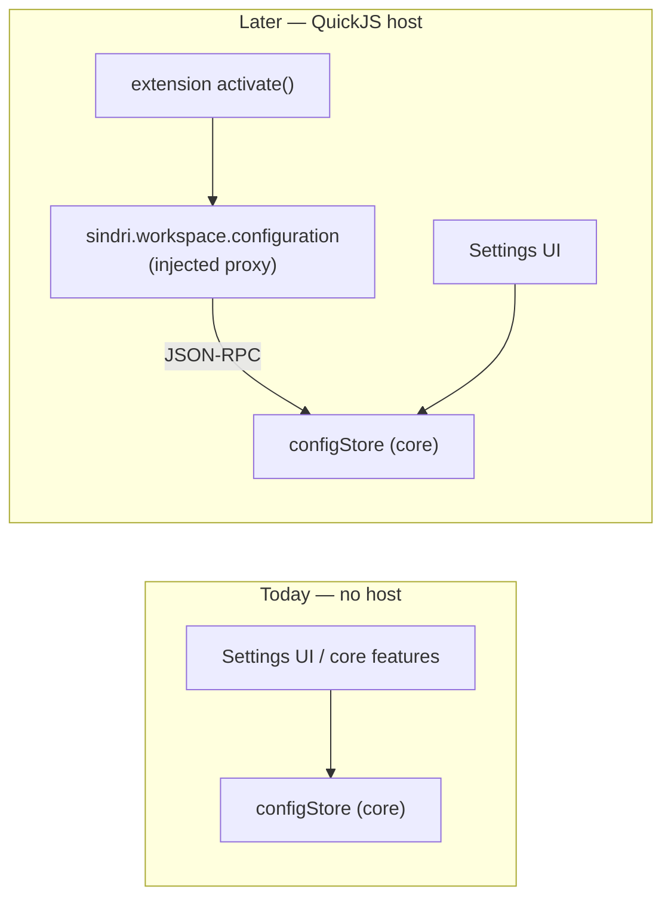

# ADR-0023: Extension configuration contract — `contributes.configuration`, settings storage & generic renderer

- Status: Accepted
- Date: 2026-06-04
- Closes deferral in: [ADR-0015](0015-js-extension-host-runtime.md) (`contributes.configuration`, `sindri.workspace.configuration`)
- Extends: [ADR-0021](0021-settings-surface.md) (the merged-schema settings surface), [ADR-0020](0020-extension-distribution-and-marketplace.md) (manifest contract)
- Forcing function: [ADR-0024](0024-editor-decorations-api.md) (rainbow brackets / indent guides must stop being hard-coded in `store.ts`)

## Context

Every non-trivial feature we ship hits the same wall: it works mechanically, but its settings end up **hard-coded in `store.ts`** (`rainbowBrackets`, `indentGuides`, `indentGuideStyle`) with a bespoke signal, setter, persistence field, and a hand-written `SettingsModal` section. ADR-0021 already decided the settings surface renders a **merged schema** aggregated from each plugin's `contributes.configuration`, but ADR-0015 **deferred** the actual schema shape, the `sindri.workspace.configuration` read/write API, and storage. A near-miss sketch exists in [`manifest.ts`](../../src/extensions/manifest.ts) (`ConfigurationField`/`ConfigurationSchema`/`ConfigurationContribution`) but is **unused** — nothing reads it, nothing stores against it.

This ADR closes that gap. It is the **minimum to unblock the dogfood model** and, critically, **needs no QuickJS host** — bundled (and later installed data-only) extensions declare config schemas as manifest JSON; core reads that JSON to auto-generate the UI and to resolve values. The host, when it lands, injects a proxy over the *same* core config store; the contract does not change.

> **Scope boundary:** this ADR owns *configuration as data* — schema, storage, resolution, rendering, and the `sindri.workspace.configuration` surface. How a feature *consumes* a config value to drive a CodeMirror decoration is [ADR-0024](0024-editor-decorations-api.md).

## Decision

### 1. Schema: a deliberately-small custom dialect, keyed by fully-qualified setting IDs

We do **not** adopt full JSON Schema. We render form controls, not validate arbitrary documents; a tiny closed dialect keeps the renderer trivial and the manifests legible. We refine the existing `manifest.ts` sketch:

```ts
export interface ConfigurationField {
  type: "boolean" | "string" | "number" | "enum";
  default: unknown;                 // REQUIRED — every field has a default (resolution §4)
  description?: string;
  // enum
  enum?: string[];                  // allowed values (type: "enum")
  enumLabels?: string[];            // human labels, positionally aligned to enum[]
  presentation?: "dropdown" | "radio";  // enum render hint; default "dropdown"
  // number
  minimum?: number; maximum?: number; step?: number;
  // layout & conditionality
  order?: number;                   // sort within a section; ties break on key
  when?: string;                    // show only if the named boolean setting is truthy
}

// Keys are FULLY-QUALIFIED dotted setting IDs (see §2): "editor.indentGuides.style".
export type ConfigurationSchema = Record<string, ConfigurationField>;

export interface ConfigurationNavSection {
  group: string;   // matches a core nav group label; unknown → "Extensions"
  label: string;   // the section item label
  order?: number;
}

export interface ConfigurationContribution {
  navSection?: ConfigurationNavSection;  // omit → "Extensions > <extension name>"
  schema: ConfigurationSchema;
}
// manifest: contributes.configuration?: ConfigurationContribution   (singular; multi-section deferred)
```

Deltas from the current sketch: `default` becomes **required**; add `enumLabels`, `presentation`, `minimum`/`maximum`/`step`, `order`, `when`. `when` is intentionally **not** an expression language — it is one boolean setting key (covers "show indent-guide style only when guides are on"; richer predicates are deferred until a real case needs them).

### 2. Key namespacing & ownership

A setting's identity is its **fully-qualified dotted ID** — the schema-map key, e.g. `editor.rainbowBrackets`. This matches VSCode, lets `configuration.get("editor.rainbowBrackets")` resolve a single key, and maps 1:1 onto the future flat `[settings]` table in `sindri.toml` (ADR-0012).

Ownership prevents collisions:

| Publisher | May contribute keys under |
|---|---|
| First-party core extensions (`publisher: "sindri"`) | reserved roots: `editor.*`, `workbench.*`, `files.*`, plus their own `<extId>.*` |
| Third-party | **only** `<extensionId>.*` (e.g. `acme.rainbow.style`) |

The loader **rejects a contribution** (and surfaces it in dev mode) if a key is already owned by another active extension or violates the prefix rule. Reserved roots are what lets the bundled editor extension own the clean `editor.*` namespace instead of a noisy `sindri.editor-decorations.*`.

### 3. Storage: one flat override map, defaults never stored

```
localStorage["sindri:config"] = { [settingId]: value }   // OVERRIDES ONLY
```

- **Flat, not per-extension-nested.** A single dotted-key→value map mirrors `configuration.get(key)` and the future `sindri.toml [settings]` table. Per-extension grouping is enforced at *schema registration* (§2), not in storage.
- **Only overrides are written.** A key absent from the map resolves to its schema default. This keeps storage minimal and means changing a default in a manifest update reaches users who never touched the setting.
- **Separate from `sindri:settings`.** The existing `sindri:settings` key keeps core-shell state (repos, installed records, locale, liveThemePreview). Config *values* move to `sindri:config`. Migration on load: lift legacy `rainbowBrackets` → `editor.rainbowBrackets`, `indentGuides` → `editor.indentGuides.enabled`, `indentGuideStyle` → `editor.indentGuides.style`, then drop them from `sindri:settings`.

### 4. Value resolution & change events

`get(key)` resolves through a precedence chain; today only two layers exist, the rest are reserved seams:

```
workspace override (sindri.toml [settings] — ADR-0012, later)
  ↳ user override (sindri:config)
      ↳ schema default (manifest)            ← always terminates here
```

A `configStore` core module owns the map, the merged schema registry, and a typed change emitter:

```ts
configStore.get<T>(key: string): T                 // resolved value, never undefined for a known key
configStore.set(key, value): void                  // writes override, persists, emits change
configStore.schemaFor(key): ConfigurationField | undefined
configStore.onDidChange(handler: (keys: string[]) => void): Disposable
```

`set` to a value equal to the default **removes** the override (keeps storage clean) and still emits. This emitter is the single bridge that lets [ADR-0024](0024-editor-decorations-api.md) rebuild a decoration when its config changes — replacing the bespoke `applyEditorFeatures()` setters in `store.ts`.

### 5. `sindri.workspace.configuration` — identical contract, host-optional

The public API (ADR-0015 §4) is a **thin proxy over `configStore`**:

```ts
sindri.workspace.configuration.get<T>(key: string): T
sindri.workspace.configuration.update(key, value): Promise<void>   // gated by `workspace.write` (ADR-0015 §6)
sindri.workspace.onDidChangeConfiguration(handler): Disposable
```



The settings UI and core features call `configStore` **directly** today. When the host ships, it injects a proxy that JSON-RPCs to the *same* `configStore`. `update` is write-gated; `get`/`onDidChange` are ungated reads. The contract authors code against never changes — this is what makes the whole configuration system shippable before QuickJS.

### 6. Settings modal: generic renderer fed by the merged registry

The nav becomes **core sections (hard-coded) + contributed sections (merged by `navSection`)**. The bespoke `EditorSection` in `SettingsModal.tsx` is **deleted** and replaced by a generic `<SchemaSection>` that walks a section's schema (sorted by `order`, then key) and maps each field to a control:

| `type` | Control | Notes |
|---|---|---|
| `boolean` | checkbox (reuse `SettingsRow`) | |
| `enum` | `<select>`, or radio group when `presentation: "radio"` | labels from `enumLabels` |
| `string` | text input | |
| `number` | number input | honours `minimum`/`maximum`/`step` |

`when` wraps a field in `<Show when={configStore.get(whenKey)}>`. Every control reads `configStore.get(key)` and writes `configStore.set(key, v)` — no per-setting signal. Contributed sections from **data-only** extensions render today (the schema is manifest JSON; no host needed); code-bearing extensions' config renders the same way once installed, the host only matters for their *runtime*, not their settings UI.

## Consequences

- **The dogfood wall comes down.** Rainbow brackets / indent guides migrate to a bundled `sindri.editor-decorations` extension contributing `editor.*` config (consumed via ADR-0024). `store.ts` sheds three signals, three setters, and three persistence fields; `SettingsModal` sheds a hand-written section.
- **New features cost a manifest entry, not a code path.** A schema field auto-renders and auto-persists; SAP adapters and language packs expose settings the day they declare them.
- **Ships without QuickJS** and is forward-identical to the host world — the `configStore`/proxy split is the whole trick.
- **Costs:** a custom schema dialect we must evolve by hand (not free JSON-Schema tooling); a one-time `sindri:settings` → `sindri:config` migration; namespace-ownership enforcement in the loader.

### Deferred

- **Workspace vs. user scope** precedence (the top layer in §4) — lands with `sindri.toml [settings]` (ADR-0012).
- **Multi-section** `configuration` (array) — singular for now.
- **Richer `when`** predicates and cross-field validation.
- `object`/`array` field types and nested groups.

## See also

- [ADR-0021](0021-settings-surface.md) — the merged-schema settings surface this fills in
- [ADR-0015](0015-js-extension-host-runtime.md) — the `sindri.workspace.configuration` deferral closed here; permission gates
- [ADR-0020](0020-extension-distribution-and-marketplace.md) — manifest contract the schema slots into
- [ADR-0024](0024-editor-decorations-api.md) — the first consumer; how config drives CodeMirror decorations
- [ADR-0012](0012-project-file-format.md) — `sindri.toml`, the future workspace-scope store
