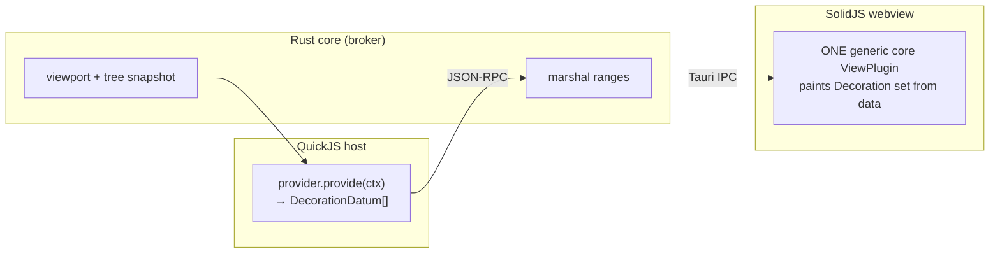
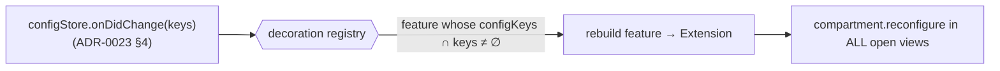

# ADR-0024: `sindri.editor` decorations API — static bundled features now, host decoration-providers later

- Status: Accepted
- Date: 2026-06-04
- Closes deferral in: [ADR-0015](0015-js-extension-host-runtime.md) (`sindri.editor` decorations)
- Consumes: [ADR-0023](0023-extension-configuration-contract.md) (config values + change events)
- Constrained by: [ADR-0003](0003-editor-surface-cm6-plus-webgl2.md) (CodeMirror 6 surface), [ADR-0016](0016-editor-buffer-and-tab-model.md) (per-tab `EditorState`)

## Context

Rainbow brackets and indent guides are CodeMirror 6 `ViewPlugin`s wired by hand: built in [`features-compartment.ts`](../../src/editor/features-compartment.ts), toggled by setters in [`store.ts`](../../src/workbench/settings/store.ts) that call `applyEditorFeatures()` to reconfigure compartments across open views. Under the **dogfood rule** (ADR-0006/0013) these should be *contributed by an extension*, not special-cased core — otherwise the day a community author wants "rainbow brackets but teal" or a new gutter decoration, the API can't express what our own UI quietly relied on.

ADR-0015 §4 listed `sindri.editor … decorations` but **deferred** the shape. This ADR defines it.

### The constraint that shapes everything: the decoration boundary

CodeMirror runs in the **SolidJS webview**. Extensions run in a **separate QuickJS host process** (ADR-0015 §2) whose `sindri.window` surface is explicitly *"view-model contributions only — no DOM access"* (ADR-0015 §4). **An extension can never hand a live CM6 `ViewPlugin` to the editor** — the object can't cross the process boundary, and the host has no DOM. Any decorations API must respect this seam. That single fact splits the design into two models that share one wiring spine.

## Decision

### 1. Contribution: name a decoration feature in the manifest

Add an `editorDecorations` key to `contributes` (ADR-0020 manifest):

```ts
export interface EditorDecorationContribution {
  id: string;            // feature id, e.g. "rainbow-brackets"
  title: string;         // human label (settings/command surfaces)
  configKeys?: string[]; // ADR-0023 setting IDs that parameterize/gate this feature;
                         // a change to any one rebuilds the feature (§4)
}
// contributes.editorDecorations?: EditorDecorationContribution[]
```

The manifest only **names** a feature; it never carries decoration code. How `id` resolves to actual decoration behaviour is the two-model split below.

### 2. Model A — static bundled features (today, no QuickJS)

The core holds a **factory table** keyed by feature id. Each factory turns config into a CM6 `Extension`:

```ts
// core/editor/decoration-registry.ts
type DecorationFactory = (cfg: ConfigReader) => Extension;   // ConfigReader = configStore.get bound

const DECORATION_FACTORIES: Record<string, DecorationFactory> = {
  "rainbow-brackets": (c) =>
    c.get("editor.rainbowBrackets") ? Prec.lowest(rainbowBrackets) : [],
  "indent-guides": (c) =>
    c.get("editor.indentGuides.enabled")
      ? makeIndentGuides(c.get("editor.indentGuides.style"))
      : [],
};
```

This is **"static"** because the `ViewPlugin` code (`rainbow-brackets.ts`, `indent-guides.ts`) is **bundled into the core build** and selected by a known id — the manifest declares intent, the bundle supplies the implementation. The bundled `sindri.editor-decorations` extension's folder *owns* these files conceptually; physically they compile into core. Full CM6 expressiveness, zero IPC, but **first-party only** — a third-party `id` with no factory-table entry is inert (and flagged in dev mode).

### 3. Model B — host decoration-providers (later, needs QuickJS)

The boundary forbids shipping a `ViewPlugin` from the host, so the dynamic model ships **decoration data**, not code. The host exposes:

```ts
sindri.editor.registerDecorationProvider(id, {
  configKeys?: string[];
  provide(ctx: DecorationContext): DecorationDatum[];   // pure: snapshot in, ranges out
}): Disposable                                          // gated by `editor.mutate` (ADR-0015 §6)

type DecorationDatum =
  | { from: number; to: number; class: string }   // inline span
  | { line: number; class: string };              // line/gutter
// ctx carries a viewport + syntax-tree snapshot the core supplies; NO DOM, NO live document.
```



A **single generic core `ViewPlugin`** receives marshalled `DecorationDatum[]` and paints them as a CM6 `Decoration` set keyed by `class` (themed via ADR-0019 token classes, same mechanism as `cm-rb-{n}`). Third-party extensions get expressive decorations **without ever touching CM6 or the DOM** — the seam holds. Model A is just the in-process special case of this (the provider *is* core code, no marshalling); Model B generalizes it across IPC. **Same contribution shape, same config wiring** — only the resolution of `id` differs.

### 4. Shared spine: a decoration registry driven by config changes

Both models plug into one registry that replaces today's `applyEditorFeatures()` plumbing:



- Each active feature owns a CM6 **`Compartment`** (today's `rainbowBracketsCompartment` / `indentGuidesCompartment` generalize to one-per-feature).
- On `configStore.onDidChange(keys)`, the registry rebuilds **only** features whose `configKeys` intersect `keys`, and dispatches a `compartment.reconfigure` to every open `EditorView` (the existing `getAllEditorViews()` loop in `features.ts`).
- New `EditorState`s (`buildEditorState`) seed each feature's compartment from current config — same role the module-level cache plays today, now reading `configStore` instead of `setCurrentEditorFeatures`.

The result: `store.ts` no longer has `setRainbowBrackets`/`setIndentGuides`/`setIndentGuideStyle` or `applyEditorFeatures` calls. Toggling a setting in the UI calls `configStore.set` (ADR-0023), which emits a change, which the registry turns into a compartment reconfigure. The decoration system becomes a pure consumer of the config contract.

### 5. `sindri.editor` surface (ADR-0015 §4 addendum)

```
sindri.editor   document model proxy · selections · onDidApplyEdit          (existing)
                registerDecorationProvider(id, provider)   ← Model B, gated by editor.mutate
                onDidChangeSelection · onDidOpenDocument                     (existing bus, §5)
```

The static Model-A path needs **no** public method — it is pure manifest contribution resolved by the core factory table. `registerDecorationProvider` is the only new runtime API, and it lands with the host.

## Consequences

- **The dogfood proof for the editor surface.** Rainbow brackets / indent guides become a real bundled extension (`sindri.editor-decorations`, `permissions: ["editor.mutate"]`, `contributes.editorDecorations` + `contributes.configuration`), not core specials. The API is exercised by our own marquee features before any third party touches it.
- **The webview/host seam is honoured by construction.** No path ever ships a `ViewPlugin` across IPC; the worst a community extension does is emit ranges+classes that one vetted core `ViewPlugin` paints. Consistent with ADR-0015's "no DOM access" and the crash-isolation goal.
- **Config and decorations are cleanly layered.** ADR-0023 owns *what the value is*; this ADR owns *what the editor does with it*. The `onDidChange` emitter is the only coupling.
- **Costs:** Model B's data-only decorations are **less expressive** than an arbitrary in-process `ViewPlugin` (no custom widgets/atomic ranges/DOM in v1) — acceptable, and extensible by growing the `DecorationDatum` union later. A static factory-table feature requires a core release to add (first-party only) — by design.

### Deferred

- **`DecorationDatum` breadth** — widget decorations, atomic ranges, replace decorations, gutter markers beyond a line class.
- **Snapshot/`provide` performance contract** — debounce, viewport-only vs. full-doc, incremental diffing across IPC (only matters once Model B ships).
- **Provider-supplied themable token registration** — for now Model B classes must resolve against existing ADR-0019 theme tokens.

## See also

- [ADR-0023](0023-extension-configuration-contract.md) — the config values + `onDidChange` this consumes
- [ADR-0015](0015-js-extension-host-runtime.md) — host/webview process split; `editor.mutate` gate; the `sindri.editor` deferral closed here
- [ADR-0003](0003-editor-surface-cm6-plus-webgl2.md) / [ADR-0016](0016-editor-buffer-and-tab-model.md) — the CM6 surface and per-tab state the registry reconfigures
- [ADR-0019](0019-theme-and-icon-system.md) — token classes decoration `class` values resolve against
