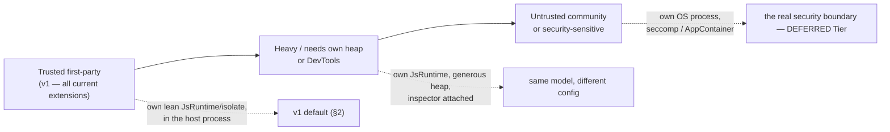

# ADR-0025: JS extension host runtime — Deno/V8 (supersedes ADR-0015 §1–2)

- Status: Accepted
- Date: 2026-06-09
- Supersedes (in part): [ADR-0015](0015-js-extension-host-runtime.md) — replaces **§1 (QuickJS engine)** and **§2 (one `rquickjs::Runtime` per extension + the future-bridged async model)**. Everything else in ADR-0015 stands unchanged: §3 ESM build model, §4 `sindri.*` API surface, §5 event bus, §6 permissions/security boundary.
- Extends: [ADR-0006](0006-extension-api-from-day-one.md), [ADR-0009](0009-remote-execution-environments.md)
- Related: [ADR-0014](0014-sindri-adapter-protocol.md), [ADR-0019](0019-theme-and-icon-system.md), [ADR-0020](0020-extension-distribution-and-marketplace.md), [ADR-0023](0023-extension-configuration-contract.md)

## Context

ADR-0015 chose **QuickJS (`rquickjs`/quickjs-ng)** as the Tier 1 extension-host engine, with one `Runtime` per extension, on two arguments: per-instance memory (~hundreds of KB vs. V8's ~5–10 MB) and a deny-by-default global surface. It reserved a Deno/V8 "Tier 2" for WASM / heavy-compute / DevTools needs.

We implemented the QuickJS host through M0–M2 (load, activate, command dispatch, the `sindri.env` async bridge). All tests pass. In doing so, three of the ADR-0015 premises proved weaker than assumed, and one ceiling proved to be a hard product wall rather than an acceptable trade.

### What implementation taught us

1. **The async bridge is a permanent, compounding tax.** Every new `sindri.*` surface fights `rquickjs`'s constraints: `Result<T,E>` requires `rquickjs::Error: From<E>`; the explicit `rt.idle()` pump must be driven by hand; stored JS callbacks need `Persistent<T>` lifetime gymnastics. This cost recurs with *every* milestone, not once.

2. **The memory argument was overstated.** The "75–150 MB" figure in ADR-0015 §workload assumed a naïvely-configured V8 isolate per extension. A *lean-configured* isolate (shared startup snapshot, small heap limits, shared platform, pointer compression — see Decision §3) lands near **~2–3 MB resident** for a light orchestration/parse extension. On a developer machine where a browser routinely holds multiple GB, ~30–150 MB across a fully-loaded polyglot project is statistical noise. This premise no longer decides anything.

3. **DevTools is a hard ceiling, not a workaround.** QuickJS has no V8 Inspector — no breakpoints, no DAP attach, no Chrome DevTools. ADR-0015 treated this as mitigable via source maps + log mode. For a professional, extension-authored product it is not: full DevTools attach for extension authors is a baseline expectation. Deno/V8 provides it via the V8 Inspector protocol.

4. **"Laggy like VSCode" is an Electron renderer problem, not a V8 problem.** Sindri runs the extension host off the UI thread (ADR-0001 separation; ADR-0006 host model). Engine choice does not affect editor responsiveness, so V8's weight carries no UI-latency penalty here.

The async-ergonomics tax (1) and the DevTools wall (3) are decisive; the collapse of the memory argument (2) removes the only counterweight. We switch the Tier 1 engine to Deno/V8.

## Decision

### 1. Runtime: `deno_core` (V8) is the Tier 1 engine

The extension host embeds **`deno_core`** (V8) on a dedicated host thread/pool, off the UI thread. The QuickJS host (`src-tauri/src/exthost/runtime.rs`) is deleted and re-implemented against `deno_core`; the module structure and the `ExtHost` interface are preserved.

The ADR-0015 "Tier 2 reserved host" concept is **dissolved** — V8 *is* the host now, so the WASM / heavy-compute / DevTools ceilings ADR-0015 deferred to Tier 2 are resolved at Tier 1. The only remaining reserved tier is the **separate-process boundary for untrusted extensions** (§4 below), which is a *trust/placement* tier, not an *engine* tier.

### 2. Isolation model: **uniform per-isolate** (one `JsRuntime` per extension)

Each activated extension gets its **own `deno_core::JsRuntime`** (its own V8 Isolate, one main realm), driven on its own thread or a bounded pool, booting from a shared snapshot, **lazily activated** on its activation event.

This reverses the "shared isolate + one V8 Context per extension" model floated during the migration spike. The reasoning, made explicit because it is subtle:

**A V8 Context is a language-level boundary, not a memory or crash boundary.** Contexts in one isolate share a heap, one GC, and one thread. They isolate *namespaces* (separate globals, access-token checks); they do **not** isolate failures. The failure-mode analysis:

| Failure mode | Shared isolate, per-Context | Per-Isolate (chosen) |
|---|---|---|
| JS `throw` / unhandled rejection | ✅ isolated (it's just an exception) | ✅ |
| Infinite loop / hang | ⚠️ one thread — watchdog `terminate_execution()` is coarse; kills whatever's running | ✅ terminate **that** isolate; siblings untouched |
| Recoverable OOM | ⚠️ shared heap; can't attribute to a context | ✅ per-isolate heap limit contains it |
| Hard OOM (hits max heap) | ❌ V8 fatal handler → process `abort()` | ⚠️ contained to that isolate's limit; restart-one |
| Native op panic | ❌ unwinding across the V8 FFI = process abort | ❌ same (mitigation: ops are `Result`, never panic) |
| GC pause | ❌ one GC pauses *all* extensions | ✅ independent GC per isolate |
| V8 engine bug / cross-context read | ❌ shared heap — a sibling's objects are reachable | ⚠️ better (separate heaps), but still shared process |

Beyond stronger isolation, per-isolate is also **the idiomatic `deno_core` grain** (the module loader, `#[op2]` ergonomics, and event loop are oriented around a runtime's *main* realm; the multi-realm/`JsRealm` API has been unstable and semi-internal across versions — running extensions in side-contexts forfeits the very ergonomics we adopt `deno_core` for) and is **less latency-prone**, not more: a shared isolate serializes every extension onto one thread and one GC, whereas per-isolate runs them in parallel with independent GC. For the I/O-plus-short-parse workload (ADR-0015 §workload) this is strictly better.

What per-isolate gives up vs. sharing is immaterial: extensions cannot share JS objects in-memory (they must not — they communicate over the event bus / JSON-RPC per ADR-0015 §5), and intra-isolate calls become cross-isolate message hops for command dispatch (microseconds, on an already-async brokered path).

### 3. Keeping a per-isolate footprint lean (implementation mandate)

Per-isolate is only affordable if isolates are configured lean rather than default. The implementation **must** apply these levers, in impact order:

| Lever | Effect |
|---|---|
| **Custom startup snapshot** (`sindri.*` bootstrap baked in) | Blob is mapped read-only and **shared across all isolates**; only live deserialized objects are per-isolate. Also eliminates cold-start time. |
| **Small heap limits** via `v8::CreateParams` (`heap_limits(initial, max)`) | Tiny initial (~1 MB), modest max (~16–32 MB) per light extension; caps resident growth and contains OOM. |
| **One shared `v8::Platform`, bounded worker pool** | V8's background GC/compile threads are shared, not multiplied per isolate. |
| **`LowMemoryNotification()` on idle** | Returns pages to the OS when an extension goes idle. |
| **Pointer compression** (already on in Deno's V8 build) | ~half-size heap objects. Keep. |
| **Lazy activation** | No isolate instantiated until the activation event fires — pay only for live extensions. |
| **`--jitless` (opt-in, per-extension)** | For pure-orchestration extensions: no RWX code pages, smaller code space, at a compute cost invisible for I/O+parse work. Off by default. |

> ⚠️ Pointer compression reserves a large *virtual* address-space cage per isolate. That is **virtual reservation, not resident RAM** — the figure that matters (working set / private bytes) is governed by the heap-limit and snapshot levers above. Do not be alarmed by multi-GB VIRT/commit numbers in a profiler; they are the cage, not committed memory.

Target: **~2–3 MB resident** per light core-extension isolate. The "~10 MB" figure is a default-configured isolate, not a floor.

### 4. Security & hard-crash boundary: separate OS process (reserved, for untrusted)

Per-isolate strengthens *accident* isolation but is **not a security boundary against malicious code**: isolates still share one OS process, so a native crash, a hard OOM, or a V8 exploit (type-confusion class) is not contained. This is exactly why Chrome uses separate OS processes per site rather than trusting in-engine boundaries.

The boundary is chosen by **trust level**, and the JSON-RPC seam from ADR-0006 makes it a *placement* decision, not an API change — the same `@sindri/api` and the same return-value/`sindri.*` contract run identically wherever the host is hosted:

For **v1, every extension is first-party and trust-equivalent to the host itself** — they already hold full `sindri.env` access by design (ADR-0015 §6), so there is nothing to sandbox them *from*, and a crash in core code is a bug to fix, not a new attack surface. In-process per-isolate is correct now.

The **separate-process tier is reserved, not designed** — it activates when untrusted community extensions exist (ADR-0020 marketplace). Because an isolate maps 1:1 onto a future process, per-isolate is also the cleanest on-ramp to it. The `net` permission (ADR-0015 §6, still off-by-default and unscoped) should be specified together with that process boundary.

### 5. `deno_core` host patterns (replacing the `rquickjs` bridge)

| Concern | QuickJS (was) | `deno_core` (now) |
|---|---|---|
| Native API binding | manual `Func`/`Async<F>` wrappers, `From<E>` fights | `#[op2]` / `#[op2(async)]` macro |
| Driving promises | explicit `rt.idle()` pump | `runtime.run_event_loop(false)` / `with_event_loop_promise` |
| Stored JS callbacks | `Persistent<T>` lifetime gymnastics | `Global<v8::Value>` handles |
| Error propagation | `std::io::Error` proxy, lossy | op returns `anyhow::Result<T>` → real JS `Error` with full message chain |
| Debugging | none | V8 Inspector (Chrome DevTools / DAP attach) |

This makes M2.5 (error propagation) nearly free: `EnvError` propagates naturally through `anyhow::Result`. For structured codes (`e.code === 'NOT_FOUND'`), a `SindriError` JS class in the injected bootstrap maps `EnvError` variants in the op implementations.

## Consequences

### What changes

- **Engine:** QuickJS → V8 via `deno_core`. `Cargo.toml`: remove `rquickjs`, add `deno_core` (pin a current version). V8 builds from source → needs `libclang` at build time and is slow on first compile (~10–20 min; use `sccache`). May require CI/build-env changes.
- **Isolation:** one `JsRuntime`/isolate per extension (was: framed as shared-isolate-per-context during the spike; never shipped). Must be lean-configured per §3.
- **Host implementation:** `src-tauri/src/exthost/runtime.rs` rewritten. Error ergonomics and authoring DX improve (DevTools, real error chains).
- **Tiering:** ADR-0015's engine-based "Tier 2" is dissolved; the only reserved tier is the trust-based separate-process boundary (§4).

### What does NOT change

- `src-tauri/src/env.rs` — the `Environment` trait seam (ADR-0009) is untouched.
- `src-tauri/src/exthost/mod.rs` — `ExtHost`, `activate`/`execute_command` signatures unchanged.
- `src-tauri/src/lib.rs` — Tauri commands unchanged.
- `packages/sindri-api/` — `@sindri/api` types unchanged.
- `scripts/build-extension.ts` — esbuild bundler unchanged (add `sourcemap: 'linked'` while here, for V8 stack-trace mapping).
- `core-extensions/sindri-hello/` — proof extension unchanged.
- **ADR-0015 §3–6** — ESM build model, `sindri.*` API surface, event bus, and the permission/security model all stand. Extensions and their authoring model are unaffected by the engine swap.

### Costs accepted

- **Build weight & time:** V8 from source (libclang, slow first compile). Mitigated with `sccache`; CI caches the V8 build.
- **Memory above QuickJS:** ~tens of MB across a loaded project vs. QuickJS's single-digit MB. Accepted as noise on target hardware (§Decision 2).
- **No same-process protection from malicious/native crashes:** by design — untrusted extensions get the separate-process tier (§4), unbuilt until the marketplace makes it real.

## See also

- [ADR-0006](0006-extension-api-from-day-one.md) — JS host model; dogfood rule; JSON-RPC seam that makes the trust ladder a placement decision
- [ADR-0009](0009-remote-execution-environments.md) — `Environment` trait; why `sindri.env` funnels all exec/fs (unchanged)
- [ADR-0014](0014-sindri-adapter-protocol.md) — SAP; first consumer of the API the host expresses
- [ADR-0015](0015-js-extension-host-runtime.md) — superseded in part (§1–2); §3–6 still in force
- [ADR-0020](0020-extension-distribution-and-marketplace.md) — marketplace; the forcing function for the §4 separate-process tier
