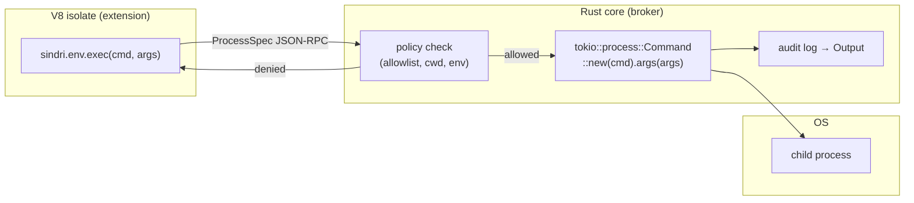

# ADR-0027: Extension capability & exec security model

- **Status:** Accepted
- **Date:** 2026-06-09
- **Touches:** [ADR-0009](0009-remote-execution-environments.md) (remote envs), [ADR-0015](0015-js-extension-host-runtime.md) §6 (permission surface), [ADR-0020](0020-extension-distribution-and-marketplace.md) (trust chain), [ADR-0025](0025-js-extension-host-deno-v8.md) §4 (untrusted-process tier)

---

## Context

`sindri.env.exec` lets a JS extension shell out to the host OS — spawn `cargo`, `git`, `pylsp`, etc. Without a deliberate security model this is a footgun: any extension that declared an `exec` permission could spawn `rm -rf ~/` or exfiltrate credentials. This ADR locks down the model before first-party extensions start using it.

The threat model is layered:

1. **Compromised/malicious extension code** — an extension that exploits a vulnerability or acts contrary to its stated purpose.
2. **Shell injection** — an attacker who can influence the extension's arguments injects shell metacharacters.
3. **Over-privileged extensions** — an extension that declares broad permissions and does more than the install dialog made visible.

This ADR addresses all three, in increasing cost order.

---

## Decision

### §1. Brokered exec — the Rust core is the only spawner

Extensions do **not** spawn processes directly. The extension sends a `ProcessSpec` over the host ops channel; the **Rust core** is the spawner and the policy chokepoint. The extension host has no `Deno.Command` access; the raw op is behind the permission gate.



**Why brokered**: the broker can enforce limits (allowlist, scoped cwd, sanitized env, resource limits) that a direct `Deno.Command` call cannot. It also owns the audit log.

### §2. Arg-vector rule — never a shell string

The broker spawns via:

```rust
tokio::process::Command::new(&spec.cmd)
    .args(&spec.args)          // argv[1..], never passed through a shell
    .current_dir(&spec.cwd)
    .envs(&spec.env)
    .spawn()?
```

The `cmd` field is a binary name or absolute path. There is **no shell interpolation**, no `sh -c`, no string concatenation of args. This eliminates shell-injection by construction — metacharacters in an argument are passed literally to the child.

**Corollary**: `sindri.env.exec("cargo", ["test", "--", "--nocapture"])` is the API; `sindri.env.exec("cargo test -- --nocapture")` is not valid (the broker rejects a `cmd` containing spaces that isn't an absolute path).

### §3. Declared-binary allowlist — the permission shape

The `"exec"` permission in `manifest.json` is **not a boolean**. It is an object that names the exact binary set the extension may spawn:

```json
{
  "permissions": {
    "exec": {
      "binaries": ["cargo", "rustc", "rust-analyzer"]
    }
  }
}
```

The broker rejects any spawn attempt whose `cmd` is not in the declared set. `PATH` resolution happens at spawn time; the declared name is matched against `Path::file_name()` of the resolved binary (absolute paths are also accepted and matched literally).

**Install-dialog surface**: the extension marketplace and the install confirmation dialog show the declared binary list in plain language — *"This extension can run: cargo, rustc, rust-analyzer"* — so the user makes an informed decision before the extension is activated.

**Why not a boolean**: a boolean `"exec": true` gives the install dialog nothing useful to show and grants blanket spawn authority. The concrete list is the whole point — it makes the risk legible and the audit log meaningful.

### §4. `net` off by default

Network access (`fetch`, TCP sockets) is **denied by default** for all extensions. An extension that needs network access must declare `"net": true` (or a scoped form — `"net": { "hosts": ["api.github.com"] }` — in a future revision). This is unchanged from ADR-0015 §6; restated here for completeness.

### §5. Scoped cwd and sanitized environment

Every spawned child has:

- **`cwd`**: the workspace root (or the `cwd` field from `ProcessSpec` if the extension explicitly passes one). **Never** inherited from the Tauri process, which may be the Sindri install directory.
- **`env`**: a clean, minimal set — `PATH`, `HOME`, `TMPDIR`, language-specific vars that the extension declares. **`SINDRI_*`, `DENO_*`, `TAURI_*`, and any credential-bearing vars** are stripped. The extension cannot see or forward the host app's environment.

The broker builds the env map from a configured allowlist + the extension's declared additions; it does not inherit `std::env::vars()`.

### §6. Audit log — every spawn is visible

Every process the broker spawns writes a structured entry to the **Sindri Output channel**:

```
[exec] cargo test -- --nocapture   (cwd: /home/user/project, pid: 12345)
[exec/exit] pid 12345 → code 0
```

This log is visible in the Output panel at all times. It is not opt-in; it cannot be suppressed by the extension. The intent is that a user who notices unexpected process activity can investigate immediately — the log is the first line of incident response.

A future revision may write structured entries to a persistent exec log (`app_data_dir/exec.log`, resolved via `app.path().app_data_dir()`) for offline forensics.

### §7. Phasing — trusted-now, sandbox-at-marketplace

This ADR describes the **Phase 1 / Phase 6 security posture** (before community marketplace):

| Phase | Trust posture | What ships |
|---|---|---|
| Phase 1–6 (now) | All extensions are **first-party, signed by us** | Allowlist enforcement, arg-vector rule, cwd/env scoping, audit log |
| Phase 7 — Extension trust & security hardening | Community marketplace opens; **untrusted** code enters | OS-process sandbox (ADR-0025 §4): per-extension isolated child process, syscall filter, resource limits; signing verification (ADR-0020); Workspace Trust UI |

The Phase 1 model is **not a placeholder**. The allowlist + arg-vector + audit log are real, meaningful protections. The OS sandbox *adds* defence-in-depth for the threat model that doesn't yet exist (untrusted community extensions). It is not needed today, and adding it now would be premature complexity.

### §8. Honest residual risk

Even with all the above, a **trusted-but-malicious or compromised first-party extension** can:

- Spawn any declared binary and pass arbitrary (valid) arguments.
- Read files the `cwd` has access to (within the workspace root).
- Write output to processes that have write access.

This is true of **every IDE** that supports extensions with exec capability — VSCode, JetBrains, Zed all have this property. The primary defence is the **trust model** (signing, marketplace vetting, Workspace Trust UI — Phase 7). The Phase 1 model limits blast radius via the allowlist and scoped env; it does not and cannot prevent a trusted extension from doing everything its declared allowlist permits.

State this in install dialogs: *"Extensions with exec permissions can run the listed programs in your workspace."*

### §9. Child-confinement subtlety

Brokered spawning does **not** automatically confine children — the broker must deliberately apply limits:

- `current_dir` must be set explicitly (not inherited).
- `env` must be constructed explicitly (not via `.inherit_env(true)`).
- File descriptors must not be inherited beyond stdin/stdout/stderr.
- On Linux, `PR_SET_PDEATHSIG` should be set so children die when the broker exits.

This requires active work in the Rust `spawn()` call; it is not free from using `tokio::process::Command`. Future hardening (Phase 7) adds a seccomp profile and a PID namespace for untrusted code; the Phase 1 implementation lays the groundwork by already owning the spawn path.

---

## Consequences

### What changes

- **`"exec": true`** is no longer a valid `manifest.json` permission value — it must be `"exec": { "binaries": [...] }`. The manifest schema and validator in [`manifest.ts`](../../src/extensions/manifest.ts) are updated.
- **The `#[op2] op_exec`** in the Deno host checks the allowlist before spawning; returns `PermissionDenied` for unlisted binaries.
- **Install dialog** reads `permissions.exec.binaries` and renders the list in plain language.
- **Output panel** receives structured exec/exit entries from the broker.

### What does NOT change

- The `sindri.env.exec(cmd, args[]) → Promise<{ stdout, stderr, code }>` API surface (already landed).
- The event bus, the isolate model, or the `sindri.tasks` SAP adapter path.
- Remote environment support (ADR-0009) — remote execs go through the same broker, dispatched to the `Environment` impl's `spawn()`.

### Deferred

- **`net` scoping** (`"net": { "hosts": [...] }`) — `"net": true` boolean for now; host-scoped allowlist in a future ADR.
- **Persistent exec audit log** to disk.
- **Resource limits** (CPU/memory caps on children) — Phase 7.
- **Syscall filter / seccomp** for untrusted community extensions — Phase 7.

---

## See also

- [ADR-0009](0009-remote-execution-environments.md) — remote envs; same broker dispatches to Environment impls
- [ADR-0015](0015-js-extension-host-runtime.md) §6 — permission surface; `exec` and `net` permissions
- [ADR-0020](0020-extension-distribution-and-marketplace.md) — signing/trust chain the Phase 7 sandbox builds on
- [ADR-0025](0025-js-extension-host-deno-v8.md) §4 — untrusted-process OS sandbox tier (Phase 7 target)
- [ADR-0026](0026-ui-panel-api.md) — `sindri-commit-streak` sample uses `exec` with `"binaries": ["git"]`
