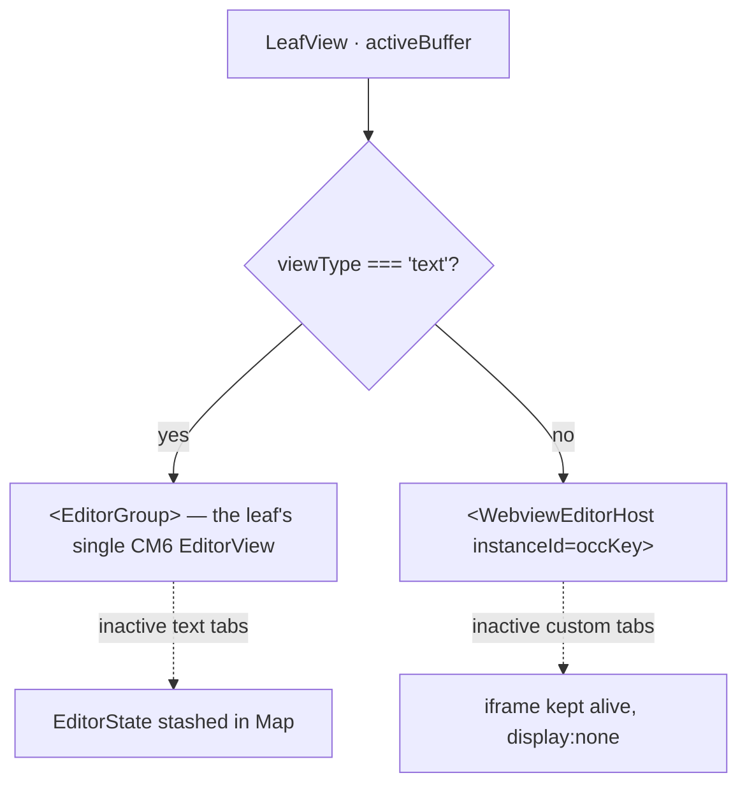
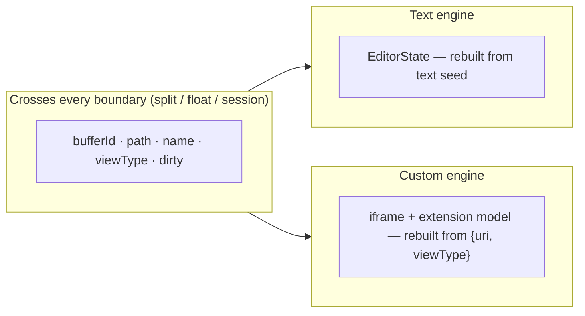
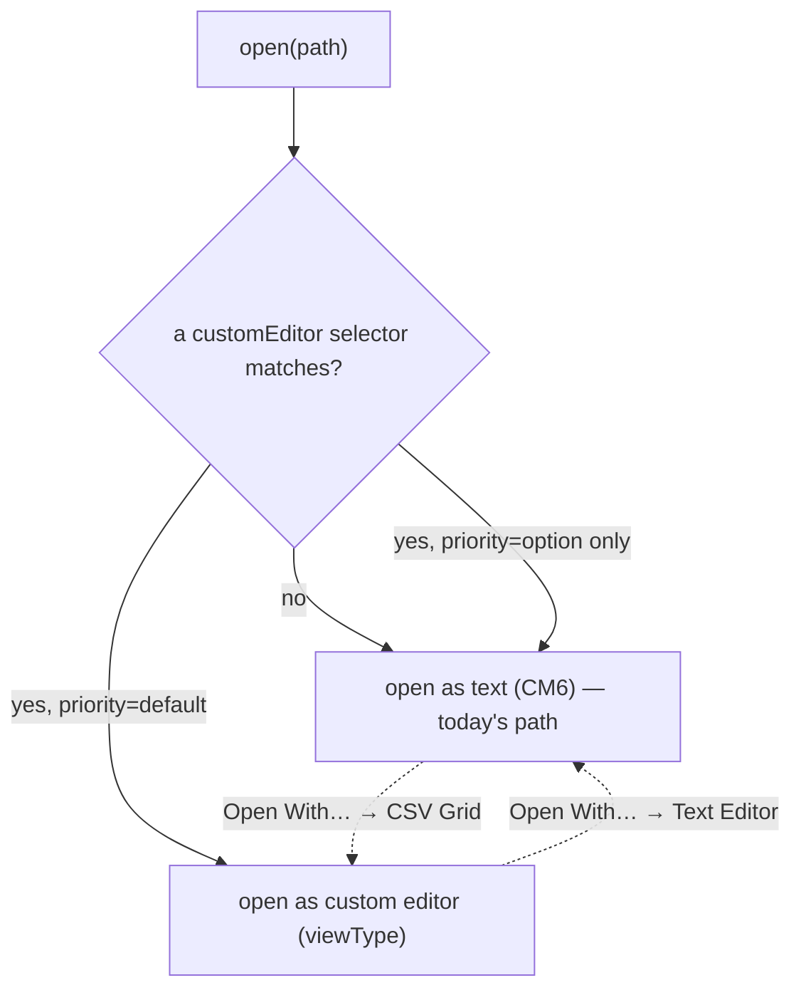

# ADR-0028: `sindri.ui.registerEditor` — custom editor surface (surface B)

- **Status:** Accepted — designed 2026-06-22 (was "Reserved — seam only" 2026-06-09)
- **Date:** 2026-06-09 · **designed:** 2026-06-22
- **Extends:** [ADR-0026](0026-ui-panel-api.md) surface taxonomy (surface B = editor-area / custom editors)
- **Constrained by:** [ADR-0016](0016-editor-buffer-and-tab-model.md) (buffer/tab model), [ADR-0018](0018-split-panes-docking-floating.md) (split/float/serialize), [ADR-0025](0025-js-extension-host-deno-v8.md) (no DOM in host), [ADR-0007](0007-webgl2-not-webgpu.md) (WebGL2 context cap)
- **Reuses:** [ADR-0026 §4](0026-ui-panel-api.md) Tier 2 webview host ([`WebviewPanelHost.tsx`](../../src/workbench/panels/WebviewPanelHost.tsx))

---

## Context

ADR-0026 §1 names **surface B** as the editor-area surface: an extension that, for a file type or URI scheme, **takes over the editor area** and renders custom content instead of the standard CM6 text editor. First-party drivers: image viewer, markdown preview, SQLite browser. The concrete driver forcing this design now is **`sindri-csv-grid`** — a button on a `.csv` opens a sortable grid **in an editor-area tab**, not a sidebar panel.

The 2026-06-09 ADR reserved the API as a named seam and deferred the real decisions. This revision makes them. Three prior decisions box the problem in:

- **[ADR-0016](0016-editor-buffer-and-tab-model.md):** the editor area is built on the rule *reactive UI metadata in Solid stores; the framework-owned mutable engine (CM6) in plain refs/Maps*. A tab is an occurrence of a buffer; **dirty = live-text vs on-disk baseline**.
- **[ADR-0018](0018-split-panes-docking-floating.md):** the editor area is a recursive split tree of leaves; **one `EditorView` per leaf**, `EditorState` keyed per **occurrence** (`${groupId}\0${bufferId}`). Splits/floats **move, don't copy** (v0). Across an OS-window boundary **only serializable metadata + a seed string cross** — the engine is rebuilt on the far side.
- **[ADR-0026](0026-ui-panel-api.md):** an extension **can never hand a live DOM node or closure across the process boundary** (host is a no-DOM V8 isolate). Tier 2 = the extension ships an HTML string; the host sandboxes it in a `null`-origin iframe and brokers `postMessage`. **Webview panels cannot float** (a populated iframe can't cross an OS-window boundary).

> ⚠️ **The fact that drives everything below:** a custom-editor leaf **has no `EditorState`.** Its document model lives *inside the extension*, reachable only through the `postMessage` bridge. Everything ADR-0016/0018 hangs off `EditorState` — stash-and-swap, dirty-by-text-compare, occurrence-keyed state moves, text-seed float — has **no `EditorState` to hang off** for a custom editor. The custom editor is not "a different kind of `EditorView`"; it is a leaf with *no engine the workbench owns*. The whole design is: **make the buffer/tab/split machinery engine-agnostic, and route the engine-specific operations (render, save, dirty, undo, serialize) through a per-instance bridge the extension owns.**

This is the editor-area analogue of the wall ADR-0024 hit for decorations and ADR-0026 hit for panels: *data and messages cross the boundary, never code or DOM.* The csv-grid stub already presumes the seam (`manifest.json` references `registerEditor`); this ADR fixes its final shape.

---

## Decision

### 1. A buffer carries a `viewType`; the leaf branches on it

The buffer registry ([`buffers.ts`](../../src/editor/buffers.ts)) gains **one reactive discriminator** on `BufferMeta`:

```ts
interface BufferMeta {
  id: string;
  path: string | null;
  name: string;
  dirty: boolean;
  viewType: string;     // "text" (CM6) | a custom-editor viewType e.g. "sindri.csv-grid"
}
```

- `viewType === "text"` → the existing CM6 path (`EditorGroup`, `buildEditorState`, occurrence-keyed `editorStates`). **Unchanged.**
- `viewType !== "text"` → a **custom-editor occurrence** rendered by a webview host; the workbench owns *no* `EditorState` for it.

`viewType` lives in the **reactive** registry (not a plain Map) because the leaf renderer must reactively switch chrome (CM view ↔ webview host) when the active tab changes. It is a plain string → fully serializable for ADR-0018 float/restore.

> **Why a per-buffer discriminator and not a per-leaf one:** a single leaf's tab strip can interleave text tabs and custom-editor tabs (open `a.ts`, `data.csv`, `b.ts` in one pane). The branch is therefore **per active buffer within a leaf**, not per leaf. This is the crucial shape: a leaf is a tab strip over *mixed* engines.

### 2. Leaf rendering: one CM view per leaf (unchanged) **+** one iframe per custom occurrence (kept alive, shown/hidden)

ADR-0016's "one persistent view, swap state" and ADR-0018's "one view per leaf" are **preserved for text** and **extended, not broken**, for custom editors:

| Engine | Instances per leaf | State home | Tab switch | WebGL2 cost (ADR-0007) |
| --- | --- | --- | --- | --- |
| **CM6 text** | **one `EditorView`**, lazily mounted when the leaf first holds a text buffer | `editorStates` Map, per occurrence | `view.setState()` swap (unchanged) | 1 context per **visible** leaf |
| **Custom editor** | **one iframe per occurrence** | inside the extension (behind the bridge) | show/hide (`display`), iframe **kept alive** | 0 (DOM viewers); see §7 for WebGL-in-iframe |

`LeafView` ([`EditorArea.tsx`](../../src/editor/EditorArea.tsx)) renders, for the active buffer:



- The CM `EditorView` is **shown when the active tab is text, hidden otherwise** — it is never destroyed just because a custom tab is foregrounded (preserves the WebGL context and stashed states).
- Each custom occurrence's iframe is **kept alive and re-parented/hidden** rather than torn down on every tab switch — the exact **keep-alive re-parenting** pattern v0.2 shipped for dock panels ([`panelHost.ts`](../../src/workbench/panelHost.ts)). Tearing the iframe down on blur would reload the extension UI and lose scroll/sort/selection.

**Always-mounted invariant (ADR-0016 §5) holds:** "closing the last tab seeds a fresh `untitled`" is unchanged — `untitled` is a `text` buffer, so a leaf always *can* host its CM view; custom occurrences are additive.

### 3. The renderer is the Tier 2 webview host, generalized from singleton to multi-instance

The custom editor **reuses [`WebviewPanelHost.tsx`](../../src/workbench/panels/WebviewPanelHost.tsx)** — same `null`-origin sandboxed iframe, same theme-token injection, same `acquireSindriApi()` bridge. The **only** generalization is identity:

| | Webview **panel** (ADR-0026 §4) | Webview **editor** (this ADR) |
| --- | --- | --- |
| Registration | one `id` = one iframe = one provider | one **`viewType`** = one provider = **N instances** |
| Instance identity | the panel `id` | the **occurrence key** `${groupId}\0${bufferId}` |
| Broker channel | `__sindri.ui.webviewMessage:{id}` | `__sindri.ui.editorMessage:{viewType}:{instanceId}` |
| Document context | none | the instance is **seeded with `{ uri, viewType }`**; the extension reads the file itself via `sindri.fs` |

Extract the host into a shared `<WebviewHost instanceId html onMessage>` core; `WebviewPanelHost` and the new `WebviewEditorHost` are thin wrappers differing only in the channel name and the per-instance HTML source. **No new sandbox/theme/bridge code** — that is the point of reusing it.

> The extension side mirrors `registerWebviewPanel` in [`bootstrap.js`](../../src-tauri/src/exthost/bootstrap.js): a `registerEditor` shim that, per resolved instance, builds the per-instance `_emit`/`onMessage` closure and emits an `__sindri.ui.editorOpened` event the frontend turns into a buffer + leaf mount.

### 4. The API: `registerEditor(viewType, selector, provider, options?)`

```ts
namespace sindri.ui {
  function registerEditor(
    viewType: string,                                   // globally unique, e.g. "sindri.csv-grid"
    selector: { scheme?: string; language?: string; pattern?: string },  // pattern: glob e.g. "*.csv"
    provider: CustomEditorProvider,
    options?: {
      priority?: "default" | "option";  // "default" → opens automatically for matches; "option" → only via Open With…
    },
  ): Disposable;
}

interface CustomEditorProvider {
  // Called once per opened document occurrence. The extension renders by assigning
  // `webview.html` and wires its per-instance message bridge. It owns the document model.
  resolveCustomEditor(document: CustomDocument, webview: EditorWebview): void | Promise<void>;

  // ── editable seam (RESERVED — see §Phasing; not called in v0) ──
  // saveCustomDocument?(document): Promise<void>;
  // onDidChangeCustomDocument?: Event<{ document; isDirty: boolean }>;
}

interface CustomDocument { uri: string; viewType: string; }   // path + type — NOT the bytes
interface EditorWebview {
  html: string;                          // assign to render (same string contract as getHtml)
  postMessage(msg: unknown): void;
  onMessage(handler: (msg: unknown) => void): void;
}
```

- **Manifest contribution** `contributes.customEditors[]` declares `{ viewType, displayName, selector, priority }` so the host knows the file→editor mapping **before** activation (lazy activation: opening a `*.csv` activates the extension). Mirrors `treeViews`/`webviewPanels` in [`manifest.ts`](../../src/extensions/manifest.ts) and the pre-registration flow in [`activation.tsx`](../../src/extensions/activation.tsx).
- **`document.uri` is the path, not the content.** Unlike a CM float (which seeds with a text string per ADR-0018 §4), a custom editor **reads its own file** through `sindri.fs` after `resolveCustomEditor`. This is *cleaner* than the CM seed: nothing but `{ uri, viewType }` ever needs to cross a boundary to reconstruct the view (see §6).

> **Namespace & permission — decided.** `registerEditor` lives under **`sindri.ui`** (it *contributes a surface*, like `registerWebviewPanel`), gated by the **`ui`** permission (ADR-0026 §7) plus a **`fs`** read grant to load the file. `sindri.editor` remains the API for manipulating the *active text editor* (decorations/selections/edits — ADR-0024/0034); it is **not** where surface contributions live. ⚠️ **Carry-forward fix:** the `sindri-csv-grid` stub manifest currently names `sindri.editor.registerEditor` / permission `sindri.editor` — correct both to `sindri.ui` / `ui` + `fs` when resurrecting it.

### 5. Save / dirty / undo routing — engine-agnostic dispatch on `viewType`

Every editor-area action the workbench fires must first ask *what engine is active*. `getActiveEditorView()` returns `undefined` when the active buffer is a custom editor — **every caller already must null-check it**, and that null branch becomes the custom-editor route:

| Action | `viewType === "text"` | custom editor — **v0 (read-only)** | custom editor — **reserved (editable)** |
| --- | --- | --- | --- |
| **Dirty** | live `view.state.doc` vs `savedTexts` baseline (ADR-0016 §3) | **always `false`** — viewer can't mutate | extension reports via `onDidChangeCustomDocument` → sets `BufferMeta.dirty` |
| **Save** (`Cmd-S`) | write `view.state.doc` | **no-op / disabled** | host calls `provider.saveCustomDocument(doc)`; extension returns bytes / writes |
| **Undo/redo** (`Cmd-Z`) | CM history in `EditorState` | **not forwarded** | host forwards an `{type:"undo"}` message; the iframe owns its undo stack |

- v0 custom editors are **read-only viewers** (csv-grid). Dirty stays `false`, Save is inert, undo isn't forwarded — the simplest correct contract, and it exercises the entire open/render/split/restore seam.
- The **editable protocol is designed here and reserved** (commented in §4): the extension owns the document model and reports dirty + handles save/undo over the bridge. This keeps ADR-0016's *dirty-is-truth* principle — the truth just lives in the extension, surfaced as a bool.

### 6. Split / float / restore — move the metadata, rebuild the engine (ADR-0018, exactly)

ADR-0018's spine — *serializable metadata crosses; the engine is rebuilt on the far side* — fits custom editors **better** than CM, because the reconstruction seed is just `{ uri, viewType }`:



- **Split / move within a window (move-not-copy, ADR-0018 §2):** the occurrence-key machinery in [`groups.ts`](../../src/editor/groups.ts) (`splitGroup`, `moveBufferToGroup`, `splitGroupWithBuffer`) moves `editorStates`/`scrollTops` between occurrence keys. For a custom buffer there is **no `editorStates` entry to move** — those moves simply **skip** (guarded by `viewType !== "text"`), and the webview host, keyed by the *new* occurrence, **rebuilds-and-reseeds** its iframe (`ready` → extension re-reads the file). For a read-only/idempotent viewer this is **lossless**. ⟶ *Reserved:* iframe **re-parenting** (the §2 keep-alive move, lossless for stateful editors) so an editable custom editor survives a split without round-tripping through disk.
- **Session restore:** the persisted unit per custom tab is **`{ bufferId, path, viewType }`** — no `EditorState`, no iframe DOM. On load, the host recreates the buffer and mounts the webview host, which calls `resolveCustomEditor` again; the extension re-reads the file. Falls straight out of §4.
- **Float to a new OS window (ADR-0018 §4 / ADR-0026 §6):** a **populated iframe cannot cross an OS-window boundary** — same standing limit as webview panels. **v0: custom editors do not float** (the Move-to-New-Window affordance is hidden for non-`text` tabs). *Reserved — degraded float:* because the seed is only `{ uri, viewType }`, the far window can **rebuild from the file** (read-only) rather than transport the iframe — the honest, ADR-0017-tiered escalation, not a fake.

### 7. Opening: default-editor routing + "Open With…"



- A **default** custom editor for a matching selector wins the plain open (explorer double-click, `openOrActivatePath`). The csv-grid smoke test rides this: register `*.csv`/`*.tsv` as **default** → opening a CSV yields the grid in an editor tab.
- **"Open With…"** (right-click a tab / a command) lists every editor whose selector matches **plus** the built-in Text Editor, and lets the user override. This is the escape hatch when the default isn't wanted and the entry point for `priority: "option"` editors.
- Dedup (ADR-0016 §4) keys on `path` **and** `viewType`: the same file open as both *grid* and *text* is two occurrences of one document — already the reserved "same buffer, two views" shape (ADR-0018 §2), kept consistent, not built in v0.

---

## Phasing — what v0 builds vs. reserves

| Phase | Scope |
| --- | --- |
| **v0 (this item)** | `viewType` on `BufferMeta`; `contributes.customEditors` + `registerEditor` broker (read-only); leaf branch (CM ↔ `WebviewEditorHost`); multi-instance generalization of the Tier-2 host (keep-alive iframes); default-editor routing + **Open With…**; split/move via skip-EditorState + rebuild-reseed; session restore from `{bufferId,path,viewType}`; **`sindri-csv-grid` resurrected as the smoke test.** |
| **Reserved (designed, not built)** | **Editable** custom documents (dirty reporting + `saveCustomDocument` + undo/edit forwarding + hot-exit backup); **iframe re-parenting** for lossless stateful move/split; **degraded float** (rebuild-in-new-window from file); **multiple editors per document** / same-doc-two-views (parallels ADR-0018 §2 transaction forwarding); **inactive-occurrence eviction** + the WebGL-in-iframe context budget (a custom editor that uses WebGL *inside* its iframe consumes an ADR-0007 context — many such tabs approach the cap; reuse ADR-0016's "close inactive after N" lever). |

---

## Consequences

**We gain**
- A custom-editor surface built by **generalizing** ADR-0016/0018 (engine-agnostic buffer/tab/split machinery) and **reusing** the ADR-0026 Tier-2 host — almost no new sandbox/bridge/serialize code; the new code is *identity plumbing* (per-instance channel) + *a branch* (`viewType`).
- Restore/float that is *simpler* than CM's, because the reconstruction seed is `{ uri, viewType }` — the extension re-reads the file rather than transporting document bytes.
- The hard features (editable docs, lossless stateful move, same-doc-two-views) are **additive later**, sitting behind the same seams ADR-0018 already reserved.

**We accept**
- **Every `getActiveEditorView()` caller must handle `undefined`** (active tab may be a custom editor) — Save, decorations (ADR-0024), the editor-state bridge (ADR-0034). Most already null-check; this ADR makes that branch load-bearing.
- **v0 custom editors are read-only and cannot float** — both are standing architectural limits (no extension document model yet; populated iframe can't cross OS-window), reserved with a designed escalation, not faked.
- **iframe keep-alive** adds the same re-parenting bookkeeping v0.2 took on for dock panels — bounded, and the pattern already exists.

**We explicitly do not do now**
- Editable custom documents, hot-exit backup, lossless stateful move, custom-editor floating, same-doc-multi-view, WebGL-in-iframe budgeting. All behind the seams above.

## Alternatives considered

| Option | Verdict | Why |
| --- | --- | --- |
| **Custom editor = a special `EditorView`** | ✗ | There is no `EditorState` to back it; forcing one re-introduces the boundary ADR-0026 spent its rationale removing. The leaf must be *engine-agnostic*, not CM-shaped. |
| **Per-leaf viewType (a leaf is all-text or all-custom)** | ✗ | A real tab strip interleaves `a.ts`, `data.csv`, `b.ts`. The branch is per active buffer; a per-leaf flag would forbid mixed groups for no gain. |
| **New bespoke renderer for editors** | ✗ | The Tier-2 host already solves sandbox + theme + bridge; editors differ only in *identity* (N instances per registration) and *document context*. Reuse, generalize identity. |
| **Transport iframe/editor state across float** | ✗ | A populated iframe cannot cross an OS-window boundary (ADR-0026 §6). The honest crossing is `{uri, viewType}` + rebuild — same discipline as ADR-0018's text seed. |
| **Editable in v0** | ✗ (defer) | csv-grid is a read-only viewer; the editable protocol (dirty/save/undo over the bridge) is designed here but unneeded to land the surface and would expand the v0 blast radius. |
| **Home it under `sindri.editor`** | ✗ | `sindri.editor` manipulates the active *text* editor (ADR-0024/0034); surface contributions (A/B/C) live under `sindri.ui` per ADR-0026. Consistency over the stub's accidental naming. |

## See also

- [ADR-0026](0026-ui-panel-api.md) — surface taxonomy; Tier 2 webview host this reuses; why webview surfaces can't float
- [ADR-0016](0016-editor-buffer-and-tab-model.md) — buffer/tab model; dirty-by-baseline; always-mounted invariant
- [ADR-0018](0018-split-panes-docking-floating.md) — split tree, occurrence-keyed engine, move-not-copy, metadata-only float
- [ADR-0007](0007-webgl2-not-webgpu.md) — the WebGL2 context cap that bounds visible CM leaves (and WebGL-in-iframe editors)
- [ADR-0024](0024-editor-decorations-api.md) / [ADR-0034](0034-editor-state-bridge.md) — `sindri.editor` (active-text-editor APIs) that must null-check the active view
- [ADR-0029](0029-editor-overlay-api.md) — surface C (editor overlays), the other reserved seam
