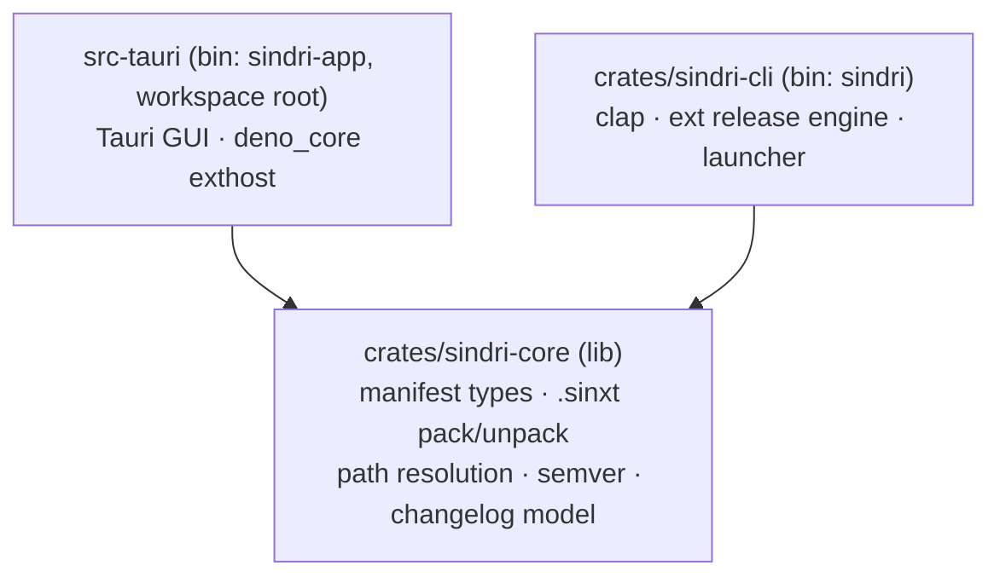
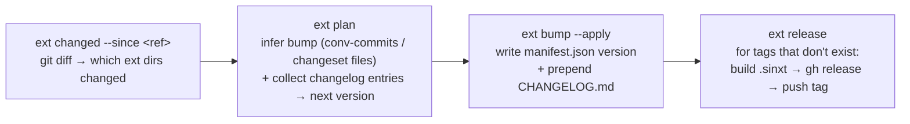

# ADR-0033: The `sindri` CLI — Rust binary, workspace topology, and the `ext` release engine

- **Status:** Accepted — 2026-06-12
- **Follows from:** [ADR-0001](0001-shell-tauri.md) (Tauri shell) · [ADR-0020](0020-extension-distribution-and-marketplace.md) (manifest, packs, `.sinxt`, git-repo registries) · [ADR-0025](0025-js-extension-host-deno-v8.md) (Deno/V8 host) · [ADR-0031](0031-resource-url-scheme.md) (bundle-dir)
- **Phase:** 1.5l — Extension CLI. Absorbs 1.5m (watch), 1.5n authoring (`ext new`), and backlog 8.5 (version-bump).

---

## Context

Sindri needs a command-line tool. Today the only "CLI" is a set of TypeScript scripts in `sindri-extensions/scripts/` (`build-extensions.ts`, `build-index.ts`, `create-releases.ts`) driven by `bun run`. They work, but they are not a CLI:

- They cannot ship independently — a consumer needs the whole `sindri-ide` + `sindri-extensions` repos checked out and a JS toolchain configured.
- They are extension-build-only. There is no launcher (`sindri .`), no runtime extension management, no self-management.
- The release logic (`create-releases.ts`, `pr-check.yml`) is bespoke per-workflow YAML + TS, not a reusable engine.

Two forces set the target:

1. **`sindri` is the `code` of Sindri.** One binary, `cargo install`-able, that opens files/folders into a running window *and* carries the authoring/runtime toolchain — the unix entry point to the whole product.
2. **`ext` is the core of our CI and bots.** GitHub Actions and a future release bot must be **thin callers** of `sindri ext …`. That means the CLI — not YAML — owns: detecting which extensions changed, inferring the bump level, collecting and applying changelogs, building `.sinxt`, tagging, and releasing. This is a **purpose-built, better-in-every-way replacement for Changesets**, tailored to manifest-as-version-source-of-truth (ADR-0020).

### Constraints

- **No TypeScript in the loop.** The CLI must not delegate to our own `*.ts` scripts. Shelling out to a general-purpose *bundler binary* for the raw JS bundle step is acceptable (a tool, like git's pager); shelling to `build-extension.ts` is not.
- **Must work with Tauri's build model.** Tauri's CLI runs from `src-tauri/`, reads `tauri.conf.json`, and expects to build the app package there. Any workspace split must preserve that.
- **CLI has no Tauri `AppHandle`.** The app resolves data dirs via `app.path().app_data_dir()` ([lib.rs:154](../../src-tauri/src/lib.rs#L154)). A standalone CLI process cannot. It must compute the *identical* `dev.sindri.app/…` paths without a Tauri runtime, and never drift from them.
- **The CLI crate must stay lean.** `sindri-app` embeds V8 via `deno_core` (ADR-0025). The CLI must `cargo install` fast and **must not** drag V8 in.

---

## Decision

### §1. One Rust binary: `sindri`

A single Rust binary named `sindri`, distributed two ways:

- **Now (authors/CI):** `cargo install --path crates/sindri-cli`.
- **Later (consumers):** shipped inside the app bundle (like `code` in `Contents/Resources/app/bin/`); `sindri install-cli` symlinks it onto `PATH`.

Argument parsing via **`clap`**. Every machine-facing command supports **`--json`** and meaningful exit codes so Actions/bots can gate on output.

### §2. Crate topology — `src-tauri` becomes a workspace

`src-tauri/` is converted into a Cargo workspace whose **root package is the Tauri app** (so `tauri.conf.json`, `tauri-build`, and the `tauri` CLI keep working unchanged), with two member crates:



```toml
# src-tauri/Cargo.toml — app package AND workspace root
[package]
name = "sindri"          # unchanged; the Tauri app
# …existing…

[workspace]
members = ["crates/sindri-core", "crates/sindri-cli"]
```

| Crate | Pulls in | Why separate |
| --- | --- | --- |
| `sindri-core` | serde, zip, semver, **dirs**, thiserror | shared truth; **no Tauri, no V8** |
| `sindri-cli` | clap, sindri-core, (shells `git`/`gh`/`bun`) | stays lean — fast `cargo install` |
| `sindri` (app) | tauri, deno_core, V8, sindri-core | the heavy GUI binary |

> Keeping the app as the **workspace root package** (not a virtual manifest) is the specific choice that keeps Tauri happy — `tauri build`/`tauri dev` still find their package and config in `src-tauri/`.

### §3. Path-resolution parity — core owns it, app conforms, a test guards drift

Resolved per the Q "can we resolve it via the app crate?": **invert the dependency.** `sindri-core` becomes the single source of truth for data/cache/log dirs, computed from the bundle identifier `dev.sindri.app` + the `dirs` crate (which is exactly what Tauri does internally):

```rust
// sindri-core
pub const IDENTIFIER: &str = "dev.sindri.app";
pub fn app_data_dir()  -> PathBuf { dirs::data_dir().unwrap().join(IDENTIFIER) }
pub fn app_cache_dir() -> PathBuf { dirs::cache_dir().unwrap().join(IDENTIFIER) }
```

- The **app** stops calling Tauri's resolver for these and calls `sindri_core::app_data_dir()` instead — so there is exactly one implementation.
- A **parity test lives in the app crate** (which has a Tauri handle in tests) asserting `sindri_core::app_data_dir() == app.path().app_data_dir()`. If a future Tauri version changes its convention, the test fails loudly rather than the CLI silently writing to the wrong place.

This gives Tauri-*verified* parity while the CLI itself never links Tauri.

### §4. Command surface

Grouped by concern. **Phase-1 slice** marked ✅; the rest is reserved map.

| Group | Command | Phase 1 |
| --- | --- | --- |
| **Launcher** | `sindri [path…]`, `-g file:line:col`, `-d a b`, `-w` (git wait), `--status` | — (needs §6 IPC) |
| **ext — release engine** (§5) | `sindri ext changed --since <ref>` | ✅ |
| | `sindri ext plan` / `status` | ✅ |
| | `sindri ext bump [--apply]` | ✅ |
| | `sindri ext changelog [--apply]` | ✅ |
| | `sindri ext build <name> [--bundle]` | ✅ (§7) |
| | `sindri ext release` | ✅ |
| | `sindri ext validate <name>` | ✅ |
| | `sindri ext build-index` | ✅ |
| **ext — authoring** | `sindri ext new <name> [--template]` (1.5n), `sindri ext dev --watch` (1.5m), `sindri ext publish` | soon |
| **ext — runtime** | `sindri ext list / install / uninstall / enable / disable / update` | early |
| **self** | `sindri doctor` | ✅ |
| | `sindri install-cli`, `sindri update` | later |

This consolidates four roadmap items into the CLI: **1.5l** (this), **1.5m** (→ `ext dev --watch`), **1.5n** authoring (→ `ext new`), **backlog 8.5** (→ `ext version-bump`/`bump`).

### §5. `ext` is a release engine — Changesets, better

The `ext` subsystem is a full release-management engine, reimplementing the logic currently spread across `create-releases.ts` and `pr-check.yml` in Rust, so CI/bots are thin callers. The model is built on facts already locked by ADR-0020:

- **Version source of truth:** `manifest.json` `version` (no `package.json` in extensions).
- **Release marker:** git tag `{id}-v{version}`.
- **Respects flags:** `buildable: false` skips build/release; `available: false` is a marketplace concern, untouched here.

Pipeline (each step pure Rust; git/gh shelled out):



- **`changed`** — `git diff --name-only <ref>..HEAD`, mapped to extension dirs; emits `--json` list of `{ id, files, buildable }`. Exit non-zero/empty ⇒ "nothing to release" so a workflow can gate cheaply.
- **`plan`/`status`** — read-only. Per changed ext: inferred **bump level** (conventional-commit prefixes — `feat`→minor, `fix`→patch, `!`/`BREAKING CHANGE`→major), the resulting **next version**, and the collected **changelog entries**. JSON. This is exactly what a bot posts as a PR comment.
- **`bump --apply`** — writes the new `version` into `manifest.json` and prepends a `CHANGELOG.md` section. Without `--apply`, dry-run JSON.
- **`changelog`** — generate/apply the `CHANGELOG.md` section independently (for backfills).
- **`release`** — the `create-releases.ts` replacement: skip any ext whose `{id}-v{version}` tag exists; for the rest, build `.sinxt` → `gh release create` → push tag; skip `buildable:false`.

> **Source of changelog/bump signal:** conventional commits touching the ext's directory by default, with optional **explicit changeset-style entries** (a markdown file naming ext + level + summary) for cases where commit inference is wrong. Hybrid: automatic by default, overridable by intent — the thing Changesets gets backwards (manual by default).

> **Tooling:** the engine shells out to **`git`** and **`gh`** (already the project standard — global instructions prefer `gh`) rather than linking `git2`, keeping the crate lean.

### §6. Launcher IPC — seam reserved, impl deferred

`sindri .` against a running app should open in the existing window. The running `sindri-app` listens on a local socket (Unix domain socket / Windows named pipe at `app_data_dir/sindri.sock`); the CLI connects and sends a JSON `open`/`goto`/`diff`/`wait`; if nothing is listening, it execs the app binary with the args (the `code → Electron` model). **No launcher command is in the Phase-1 slice** — only the seam is reserved here.

### §7. Bundler — shell to `bun` now; pinned-esbuild later; watch rolldown

`ext build`'s only non-Rust step is the JS transpile+bundle. Rust owns everything else (manifest parse, `@sindri/api` injection, asset copy, `.sinxt` zip, validation). For the bundle primitive:

- **Now:** shell out to **`bun build`** (already the mandated toolchain — pnpm is broken project-wide). `sindri doctor` checks for it.
- **Later:** auto-fetch a **pinned `esbuild`** into `app_cache_dir/toolchain/` so `cargo install sindri` self-bootstraps with nothing on `PATH`.
- **Watch:** **rolldown**'s Rust bundler API is not yet public/stable; revisit for a pure-Rust path (tracked in backlog 8.5). `deno_core` is already embedded in the app — running a JS bundler inside the V8 we already ship is the "fully self-contained" endgame, rejected for v1 only because it would drag V8 into the lean CLI crate.

---

## Consequences

- ✅ One distributable `sindri` binary; CI/bots become thin `sindri ext …` callers; release logic leaves YAML for testable Rust.
- ✅ `sindri-core` de-duplicates pack/install/path logic between app and CLI; the parity test makes path drift a loud failure.
- ✅ Four roadmap items (1.5l/m/n + 8.5) consolidate into one subsystem.
- ⚠️ Converting `src-tauri` to a workspace is a real (if mechanical) refactor; `tauri dev/build` must be re-verified after the split.
- ⚠️ `ext build` requires `bun` on `PATH` until the pinned-esbuild fetch lands — `sindri doctor` must report this clearly.
- ⚠️ The release engine must reach byte-parity with today's `create-releases.ts`/`pr-check.yml` behavior before those workflows are cut over; until then they coexist.

### Phased delivery

1. `sindri-core` + `sindri-cli` workspace scaffold (clap) — verify `tauri dev/build` still green.
2. Pure-Rust, no-bundler commands first: `ext version-bump`/`bump`, `ext validate`, `ext changed`, `ext plan`, `doctor`.
3. `ext build` (the bun fork) + `ext release` — then cut workflows over to call the CLI.
4. Reserve launcher IPC (§6) and authoring (`ext new`/`dev`) for subsequent phases.

## Alternatives considered

- **CLI shells into our `*.ts` scripts** — rejected (constraint #1): not independently shippable; not a real CLI.
- **`core` chases Tauri's path output** — rejected for §3's inversion: makes Tauri the source of truth the CLI can't reach; the inversion + parity test is strictly better.
- **Pure-Rust bundler now (swc_bundler / oxc + hand-rolled graph)** — rejected: correctness risk on arbitrary extension code is high, reward low; revisit via rolldown when its Rust API stabilizes.
- **One binary with a `--cli` mode flag** — rejected: would link V8 into every CLI invocation; two binaries sharing `sindri-core` keeps the CLI lean.
- **`git2` crate** — rejected in favor of shelling `git`/`gh` to keep the crate lean and match existing `gh`-first tooling.
