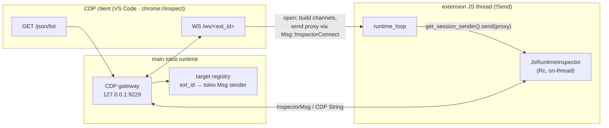

# ADR-0037: Extension debugging — V8 Inspector / CDP gateway

- **Status:** Accepted — 2026-06-13
- **Follows from:** [ADR-0025](0025-js-extension-host-deno-v8.md) (Deno/V8 isolate, one `JsRuntime` per extension on a dedicated `!Send` thread) · [ADR-0030](0030-extension-output-logging.md) (the other half of author DX — logging)
- **Phase:** 1.5k — Extension author DX · the last unshipped API item in Phase 1

---

## Context

Extension authors can today inspect their code only through `console.log` (ADR-0030) and source-map-translated stack traces (ADR-0025 §5). There is no way to set a breakpoint, step through a handler, inspect live variables, or profile. Every other item in 1.5 has landed; this is the one remaining author-DX gap before Phase 1 closes.

V8 already contains a full debugger. `deno_core` exposes it via `JsRuntimeInspector`, which speaks the **Chrome DevTools Protocol (CDP)** — the same protocol Chrome DevTools, VS Code's JavaScript debugger, and `chrome://inspect` all attach to. The work is **not** to build a debugger; it is to **expose V8's inspector over a WebSocket** so an external CDP client can attach, while respecting our per-extension-isolate threading model.

### What the runtime looks like today (the constraint)

From [exthost/runtime.rs](../../src-tauri/src/exthost/runtime.rs):

- One `JsRuntime` per extension, each owned by a dedicated `std::thread` running a **single-threaded** tokio runtime. `JsRuntime` is `!Send`, so it can never leave that thread.
- The thread's `runtime_loop` **blocks on `rx.recv().await`** (a tokio mpsc of `Msg`) and only touches V8 when a message (`DispatchCommand`, `DispatchEvent`, …) arrives. Each handler runs a script, calls `run_event_loop` until the microtask queue drains, and goes **back to blocking on `recv`**.
- `ExtensionRuntime` is the `Send` handle the rest of the app holds; it talks to the thread purely through that mpsc + per-call oneshots.

### The precise `deno_core` 0.403 inspector surface

Verified against the pinned crate source:

| Item | Signature / shape |
|---|---|
| Enable | `RuntimeOptions { inspector: true, .. }` — off by default |
| Accessor | `JsRuntime::inspector() -> Rc<JsRuntimeInspector>` (interior-mutable; `!Send`, lives on the JS thread) |
| Inject a session | `JsRuntimeInspector::get_session_sender() -> futures::channel::mpsc::UnboundedSender<InspectorSessionProxy>` |
| Session channels | `InspectorSessionChannels::Regular { tx: UnboundedSender<InspectorMsg>, rx: UnboundedReceiver<String> }` — `tx` = V8→client, `rx` = client→V8 (raw CDP JSON strings) |
| Session kind | `InspectorSessionKind::NonBlocking { wait_for_disconnect: false }` for a WS client |
| Outbound message | `InspectorMsg { kind: Notification | Message(call_id), content: serde_json::Value }` |
| Pause-on-entry | `wait_for_session_and_break_on_next_statement()` |
| Liveness | `sessions_state() -> SessionsState`; `PollEventLoopOptions { wait_for_inspector: bool, .. }` |

> ⚠️ **The load-bearing fact:** the inspector only services CDP traffic while `poll_sessions` runs, and `poll_sessions` only runs **inside `run_event_loop`**. Our thread sits in `rx.recv().await` between dispatches and never polls V8 while idle. **An attached debugger would be frozen the moment the extension goes quiet** — which is almost always. Resolving this is the core of this ADR (§4).

`InspectorSessionProxy`, `InspectorMsg`, and the `futures` channel halves are all `Send` (they carry `serde_json::Value` / `String`). This is what lets us hand a session across the thread boundary.

---

## Decision

Ship an **on-demand, dev-gated, single-port CDP gateway**. One loopback WebSocket server, owned by `ExtHost` on the main tokio runtime, multiplexes every debuggable extension isolate as a distinct CDP target. The JS thread switches into a continuous polling mode only while a session is attached, and falls straight back to idle-blocking when the last client disconnects — **zero overhead for the un-debugged / production case**.



### §1. Scope — attach-to-running, dev builds, loopback only

| Dimension | Phase 1.5k decision | Rationale |
|---|---|---|
| **Topology** | **Single gateway** on `127.0.0.1:9229`, one CDP target per extension | What Node/Deno/Chrome clients expect; one endpoint to discover all extensions |
| **Trigger** | **On-demand** — port opens on first "Attach Debugger" action, not at startup | No idle listener; nothing to attack in the common case |
| **Build gating** | Enabled only when `cfg!(debug_assertions)` **or** `SINDRI_INSPECT=1` | Release builds ship with `inspector: false` and no gateway — zero surface |
| **Bind address** | `127.0.0.1` **only**, never `0.0.0.0` | CDP = unauthenticated full code-exec in the isolate; must never face the network |
| **Pause-on-entry** (`--inspect-brk`) | **Deferred** — seam reserved (§5), not shipped | Requires deferring `activate()` until a client attaches; a larger flow. Attach-to-running covers the 90% case |
| **Client surface** | VS Code `attach` + `chrome://inspect`, documented per-extension | Both consume the same `/json` + WS endpoints; no Sindri-specific client |

### §2. The CDP gateway (main thread)

A small `hyper` + `tokio-tungstenite` server bound to `127.0.0.1:9229`, owned by `ExtHost`. It serves the two discovery endpoints every CDP client probes, plus the per-target WS upgrade:

| Endpoint | Response |
|---|---|
| `GET /json/version` | `{ "Browser": "Sindri/<app-version>", "Protocol-Version": "1.3" }` |
| `GET /json` and `GET /json/list` | one target object **per registered extension** (§3) |
| `GET /ws/<ext_id>` | WebSocket upgrade → bridges to that extension's isolate (§3) |

`ExtHost` keeps a **target registry**: `HashMap<ext_id, TargetEntry>` where `TargetEntry` holds the extension's display name, bundle path (for the `url` field), and a clone of the tokio `Msg` sender to that extension's JS thread. The registry is populated as extensions activate and pruned as they unload — it is the single source of truth for `/json/list`.

> The gateway is **lazily started**: the listener binds the first time a target is registered *and* debugging is enabled for the session. Until then there is no open socket.

### §3. Per-target WebSocket bridge (the thread-boundary crossing)

When a client opens `GET /ws/<ext_id>`, the **gateway** (main thread) does the channel construction so it keeps the opposite ends:

```rust
use futures::channel::mpsc;

// V8 → client; client → V8
let (out_tx, out_rx) = mpsc::unbounded::<InspectorMsg>();   // gateway reads out_rx, writes to WS
let (in_tx,  in_rx)  = mpsc::unbounded::<String>();          // gateway writes in_tx from WS frames

let proxy = InspectorSessionProxy {
    channels: InspectorSessionChannels::Regular { tx: out_tx, rx: in_rx },
    kind: InspectorSessionKind::NonBlocking { wait_for_disconnect: false },
};

// Hand the proxy to the isolate THROUGH OUR EXISTING tokio mpsc — this both
// delivers the session AND wakes the JS thread out of `rx.recv().await`.
msg_tx.send(Msg::InspectorConnect { proxy }).ok();

// Gateway then bridges for the life of the WS connection:
//   out_rx  -> serialize InspectorMsg.content -> WS text frame
//   WS text frame -> in_tx.unbounded_send(String)
```

The proxy travels over our **existing** `Msg` channel rather than being injected directly via `get_session_sender()` from the main thread. This is deliberate and buys two things at once:

1. **It is the wake signal.** Sending `Msg::InspectorConnect` unblocks the JS thread's `rx.recv().await` — without it, a session injected straight into the `!Send` inspector would sit unserviced until the next unrelated dispatch.
2. **It keeps the `!Send` inspector strictly on its thread.** The JS thread receives the (`Send`) proxy and calls `self.rt.inspector().get_session_sender().unbounded_send(proxy)` locally; the main thread never touches the inspector.

New `Msg` variants:

```rust
enum Msg {
    // … existing …
    InspectorConnect { proxy: InspectorSessionProxy },  // a client attached
    // (no explicit disconnect msg: the bridge drops out_rx/in_tx; the inspector
    //  observes the closed channel and prunes the session on its next poll)
}
```

### §4. The dual-mode JS loop (resolves the idle-polling problem)

The JS thread runs in one of two modes, switching on whether any inspector session is live:

- **Idle mode (default, and *the only* mode in production):** block on `rx.recv().await`, exactly as today. Zero V8 polling, zero cost.
- **Debug mode (entered on first `InspectorConnect`):** drive the event loop continuously so `poll_sessions` keeps servicing CDP traffic, while still accepting dispatch messages. Implemented with a `select!` over the message channel and the event loop:

```rust
// Pseudocode for runtime_loop's debug branch.
loop {
    tokio::select! {
        biased;
        maybe_msg = rx.recv() => match maybe_msg {
            Some(Msg::InspectorConnect { proxy }) => {
                rt.inspector().get_session_sender().unbounded_send(proxy).ok();
            }
            Some(other) => handle_dispatch(&mut rt, other).await,
            None => break,                         // handle dropped → shut down
        },
        // Polls V8 AND the inspector. Returns Ready when the loop has no more
        // work; we then re-arm only if sessions remain (see below).
        _ = poll_event_loop(&mut rt) => {}
    }

    if rt.inspector().sessions_state().has_active == 0 {
        return /* to idle mode: */ ;   // last client gone → stop hot-looping
    }
}
```

Mode transitions:

| From | Event | To |
|---|---|---|
| Idle (`recv`) | `Msg::InspectorConnect` arrives | Debug (`select!` loop) |
| Debug | `sessions_state()` shows 0 active sessions | Idle (`recv`) |

Breakpoints set by the client while the extension is idle now bind correctly: in debug mode V8 is being polled, so `Debugger.setBreakpoint` is processed immediately and the next dispatch hits the breakpoint and pauses inside `poll_event_loop`.

> The cost of debug mode (a busy-ish event-loop spin) is paid **only while a developer is actively attached to that one extension**. Every other isolate, and the entire production build, stays in idle mode.

### §5. `--inspect-brk` / activation breakpoints — reserved seam

Pausing on the first line of `activate()` requires (a) a session attached *before* the bundle runs and (b) calling `wait_for_session_and_break_on_next_statement()` ahead of `do_load_and_activate`. That means deferring activation until a debugger connects — a UX and lifecycle change (the extension appears "stuck" until you attach) beyond this slice.

The seam: `Msg::LoadAndActivate` gains no new field now, but the design admits a future `break_on_entry: bool` that, when set, parks the thread in `wait_for_session_and_break_on_next_statement()` before executing the bundle. Tracked as a Phase 2 follow-up.

### §6. Surfacing to the author

- **Command:** `Extensions: Attach Debugger…` in the command palette → quick-pick of loaded extensions → registers the target, lazily starts the gateway, and shows the `webSocketDebuggerUrl` + a "open chrome://inspect" hint via `showInformationMessage`.
- **VS Code:** documented `.vscode/launch.json` snippet:

```jsonc
{
  "type": "node",
  "request": "attach",
  "name": "Attach to Sindri extension",
  "address": "127.0.0.1",
  "port": 9229,
  "localRoot": "${workspaceFolder}",
  "sourceMaps": true   // pairs with the .js.map emitted by `sindri ext build` (ADR-0025 §5)
}
```

Source maps already emitted by the dual-build pipeline (ADR-0025 §5 / 1.5b) mean breakpoints land on the **original TypeScript**, not the bundled JS — the debugger story reuses the artifacts we already produce.

---

## Consequences

### What changes

| File | Change |
|---|---|
| `src-tauri/Cargo.toml` | `tokio-tungstenite` (+ `hyper` if not already transitive) as a dependency; the gateway behind a `debug_assertions`/env gate |
| `exthost/runtime.rs` | `RuntimeOptions { inspector: true, .. }` when gated on; `Msg::InspectorConnect`; dual-mode `runtime_loop` (§4); `get_session_sender` plumbing on the JS thread |
| `exthost/mod.rs` | Target registry (`ext_id → TargetEntry`), populated on activate / pruned on unload; lazy gateway start |
| `src-tauri/src/inspector_gateway.rs` *(new)* | The `hyper` + `tokio-tungstenite` CDP server: `/json`, `/json/version`, `/ws/<ext_id>`, and the per-session WS↔channel bridge |
| `lib.rs` | A Tauri command behind `Extensions: Attach Debugger…`; wire the palette entry |
| `docs/design/roadmap.md` | Mark 1.5k ✅ |

### What does NOT change

- `ExtensionRuntime`'s public async API (`dispatch_command`, `dispatch_event`, …) — debugging is orthogonal; it rides the same `Msg` channel.
- The idle/production path — with the gate off, `inspector: false`, no `select!` loop, no listener. **Byte-for-byte the current behavior.**
- The bootstrap, ops, or source-map translation — untouched.

### Security properties

| Property | Phase 1.5k | Phase 7 target |
|---|---|---|
| Reachability | `127.0.0.1` only; gateway absent unless dev-gated **and** a target is registered | Unchanged (loopback is the ceiling) |
| Authentication | None beyond loopback (matches Node `--inspect` / Deno) | Optional per-session token in the WS path |
| Capability when attached | Full CDP: arbitrary eval, heap/exec inspection of that isolate | Unchanged — debugging *is* total access by definition |
| Production exposure | None — compiled-out / env-gated off | None |

CDP grants total control of the isolate, so the entire defense is **"never bind beyond loopback, never ship it enabled."** This sits squarely inside the ADR-0025 §4 trust model: in Phase 1 all extensions are already fully trusted, and the developer attaching a debugger is debugging *their own* extension.

### Trade-offs accepted

- **Busy-spin while attached.** Debug mode trades idle efficiency for CDP responsiveness, but only for the one isolate being debugged, only while attached. Acceptable — it is a developer action, not a runtime default.
- **No pause-on-entry yet.** Authors cannot break on `activate()`'s first line in 1.5k; they attach to a running extension and break on the next event/command. The seam (§5) keeps the door open without paying for it now.
- **Single fixed port (9229).** If occupied, the gateway fails to bind and the command reports it. A configurable port is a trivial later addition; 9229 is the universal CDP default and the right zero-config choice.

---

## See also

- [ADR-0025](0025-js-extension-host-deno-v8.md) — the Deno/V8 host, per-isolate threading, and the source maps the debugger consumes
- [ADR-0030](0030-extension-output-logging.md) — the logging half of author DX; debugging is the interactive complement
- `deno_core` 0.403 `inspector.rs` — `JsRuntimeInspector`, `InspectorSessionProxy`, `get_session_sender` (the verified primitives this ADR builds on)
