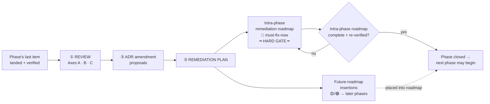

# End-of-Phase Review — protocol

> The mandatory gate between every roadmap phase. Opened only when a phase's last item is **landed and verified**; not a turn-by-turn reference. Run it, write the artifact, clear the gates, then start the next phase.

- **When:** the final item of a phase is done **and verified** — *before* any next-phase work begins.
- **Model:** **Fable 5** for the judgment pass (this is the north-star, whole-system review the model table reserves Fable for). **Opus 4.8** acceptable for small phases. **Never Sonnet/Haiku for judgment** — those only run the mechanical scans (§7).
- **Nature:** a **hard, two-stage gate**. The phase is not closed, and the next phase may not begin, until *both* stages pass (§6).

---

## The two-stage gate



**Gate 1 — the review** can't end `BLOCKED`. **Gate 2 — the intra-phase remediation roadmap** must be fully executed and re-verified. Findings that don't need fixing now are **inserted into the future roadmap at the correct phase** — tracked, never dropped.

---

## Inputs (what the reviewer reads)

| Source | Why |
|---|---|
| [vision.md](../design/vision.md) | The thesis to measure drift against |
| All of [docs/adr/](../adr/) | Every locked decision — for drift + amendment checks |
| [roadmap.md](../design/roadmap.md) — the phase just closed | Its stated goals (but **Axis C reconstructs goals independently first**) |
| [HANDOVER.md](../../../HANDOVER.md) + [CLAUDE.md](../../../CLAUDE.md) | Doc-truth claims to validate |
| The codebase (via §7 scans) | Engineering reality |

---

## Axis A — Vision & Decision Integrity *(did we drift?)*

| # | Check | Finding → disposition |
|---|---|---|
| **A1** | **Thesis fidelity** — for each founding pillar (human-first not AI-native · polyglot / language-agnostic · everything-is-an-extension), cite concrete evidence from this phase that it held, **or** flag where a feature quietly optimized against it | drift → corrective task + ADR note |
| **A2** | **Decision drift** — does any shipped code diverge from its ADR with no addendum? (ADR says X, code does Y) | each → code fix *or* ADR addendum |
| **A3** | **Undocumented decisions** — significant choices made mid-phase that never became an ADR | → write the missing ADR |
| **A4** | **ADR amendment surfacing** *(required output)* — actively re-read the hard decision-points of **earlier** ADRs. Any that no longer make sense in light of what we've since built get **surfaced with a concrete proposed amendment** — not just "this is stale," but "amend ADR-00XX §N to say Y, because Z." Feeds the dedicated artifact section (§5) | → amendment / superseding ADR |
| **A5** | **Doc truth** — vision / roadmap / CLAUDE.md / HANDOVER claims that no longer match reality | → correct the doc |

---

## Axis B — Engineering & Architecture Health *(is it still stellar?)*

> Line counts are **smells that trigger judgment, not verdicts.** The real test is always single-responsibility. A focused 450-line state machine can be fine; a 250-line file doing three unrelated things is not.

| # | Check | Threshold / rule |
|---|---|---|
| **B1** | **File size** | **Rust:** target 150–350 · 🟡 **review > 400** · 🔴 **split > 600** (unless a documented cohesive reason). **Frontend:** target < 250 · 🟡 > 300 · 🔴 > 500 |
| **B2** | **Decomposition health** — no crate or area may concentrate the majority of its logic in a handful of god-files. Each subsystem, each Tauri-command domain, each component is its own module. Prefer **extracting embedded assets** (e.g. a large JS bootstrap string → its own `.js` loaded via `include_str!`) over letting them inflate a source file | judgment, informed by the size census |
| **B3** | **Frontend styling** — **SCSS files only.** No inline `style={…}`, no raw `.css`. Colours and spacing come from theme tokens (ADR-0019), not magic literals | grep `style={` / `style="`, `*.css` |
| **B4** | **No speculative abstraction / dead code** — unused exports, one-caller abstractions, commented-out blocks. Implement what's needed, not what might be | grep + judgment |
| **B5** | **No `unsafe` Rust** unless **explicitly required** (e.g. an FFI / V8 boundary that has no safe alternative). Every `unsafe` block carries a justifying comment and, if non-trivial, an ADR note. Safety + performance is *why* Rust was chosen — `unsafe` forfeits half of that and must earn its place | grep `unsafe` |
| **B6** | **Tests in their own files** — unit tests live in a **dedicated sibling file** via `#[cfg(test)] mod tests;` → `foo/tests.rs` (fully idiomatic Rust *and* keeps the source file lean); integration tests in `tests/`. Frontend tests alongside as `*.test.ts(x)`. No large inline `#[cfg(test)]` modules bloating a source file | scan |
| **B7** | **Test health** — every shipped feature of the phase has tests; the whole suite passes; no silent `#[ignore]` / `.skip` without a written reason | run suite |
| **B8** | **Platform-agnostic paths** — no hardcoded OS data/cache/log dirs; everything resolves via `app.path()` / the Tauri path API (CLAUDE.md rule) | grep `~/.`, `/Users/`, `Library/`, `AppData`, `.local/share` |
| **B9** | **Error boundaries** — consistent, typed errors; no `unwrap()`/`expect()` on fallible runtime paths outside tests/bootstrap; no silently swallowed errors | grep + judgment |
| **B10** | **Dependency hygiene** — every new dep justified, no duplicates/overlap, licenses AGPL-compatible | scan `Cargo.toml` / `package.json` diffs |
| **B11** | **Naming, idiom & boundary integrity** — new code reads like its neighbours; the Rust ↔ JS ↔ webview seams stay clean (e.g. the IPC camelCase contract) | judgment |

---

## Axis C — Phase Completeness & Gap Analysis *(did we build what the phase **should** be?)*

| # | Check | Finding → disposition |
|---|---|---|
| **C1** | **Reconstruct from first principles** — from the vision + the phase's theme, **independently derive what a complete version of this phase contains, before looking at the roadmap checklist.** Then diff that ideal against what shipped. This is the core anti-tunnel-vision step — it catches what we never thought to list | the diff drives C2 |
| **C2** | **Missed goals** — capabilities a coherent version of the phase should have, that we never even enumerated | → pull into scope (intra-phase) *or* backlog with explicit rationale |
| **C3** | **Deferred-items audit** — every "Phase N / backlog / reserved seam" punt made during the phase: is the deferral still correct, or did it quietly become a hole? | → re-scope or confirm |
| **C4** | **Seam check** — did we leave the right extension points for downstream phases (ADR-0028/0029-style reserved seams honoured and still coherent)? | → add the missing seam |
| **C5** | **Scope creep** — did we build premature next-phase work? (not fatal — noted, and may let us tick a future item) | note |
| **C6** | **Coherence / integration** — do the phase's features compose into a usable whole, or are there gaps *between* individually-"done" items? | → integration task |

---

## Output artifact — `docs/reviews/phase-<N>-review.md`

Append-only, dated, one per phase. Structure:

1. **Header** — phase, date, reviewer model, one-line verdict.
2. **Findings** — Axes A / B / C, each finding tagged **🔴 blocker · 🟡 should-fix · 🟢 note**, with an explicit **disposition** (ADR to write · cleanup task · backlog item · accept-as-is).
3. **ADR amendment proposals** *(first-class — from A4)* — table of `ADR-00XX §N → proposed change → why`. Empty is a valid, stated result.
4. **Remediation plan** — the two buckets below.
5. **Verdict + gate status.**

### Remediation plan (the heart of stage two)

| Bucket | Contents | Gate |
|---|---|---|
| **Intra-phase remediation roadmap** | All 🔴 + any 🟡 judged unsafe to carry forward, as an **ordered, actionable task list** | **HARD GATE** — every item done **and re-verified** before the next phase begins |
| **Future-roadmap insertions** | 🟡/🟢 that fold cleanly into later phases | Each is **written into [roadmap.md](../design/roadmap.md)** at its target phase, with a back-reference to this review |

### Verdict

| Verdict | Meaning |
|---|---|
| `PASS` | No 🔴, no intra-phase remediation needed. Proceed. |
| `PASS-WITH-FOLLOWUPS` | No 🔴; future-roadmap insertions recorded. Proceed once they're written into the roadmap. |
| `BLOCKED` | 🔴 present **or** intra-phase remediation roadmap outstanding. **Next phase may not start.** |

---

## Execution flow & cost discipline

The review is expensive (a top-tier model reading the whole system). Keep the noise out of that context:

1. **Mechanical scans first — delegate to Explore/Haiku/Sonnet subagents** (`model` param) as a **context firewall**. Their raw output never enters the Fable judgment context; only conclusions return. Scans to delegate:
   - file-size census (Rust + frontend)
   - inline-style + `.css` grep (B3)
   - `unsafe` grep (B5)
   - inline-test-module scan (B6)
   - hardcoded-path grep (B8)
   - `unwrap`/`expect`/swallowed-error grep (B9)
   - dependency-diff + license scan (B10)
   - full test-suite run (B7)
2. **Judgment pass on Fable 5** — read vision + ADRs + the scan conclusions; perform Axes A/B/C reasoning, the ADR-amendment analysis, and the first-principles reconstruction (C1).
3. **Write the artifact**, open the intra-phase tasks, and insert future items into the roadmap.

### Scan command starter kit

```bash
# B1 file-size census (Rust + frontend)
find src-tauri/src src-tauri/crates -name '*.rs' -exec wc -l {} + | sort -rn | head -30
find src -name '*.tsx' -o -name '*.ts' | xargs wc -l | sort -rn | head -20
# B3 styling
grep -rn 'style={\|style="' src --include='*.tsx' | wc -l ; find src -name '*.css'
# B5 unsafe
grep -rn 'unsafe' src-tauri/src src-tauri/crates --include='*.rs'
# B8 hardcoded paths
grep -rnE '~/\.|/Users/|Library/|AppData|\.local/share' src-tauri/src src --include='*.rs' --include='*.ts' --include='*.tsx'
# B9 fallible-path unwraps (filter out tests)
grep -rn '\.unwrap()\|\.expect(' src-tauri/src src-tauri/crates --include='*.rs' | grep -v 'test'
```

---

## See also

- [vision.md](../design/vision.md) — the thesis Axis A measures against
- [roadmap.md](../design/roadmap.md) — phases; future-roadmap insertions land here
- [docs/adr/](../adr/) — the decisions Axis A audits and proposes amendments to
- [reviews/](../reviews/) — the output artifacts
